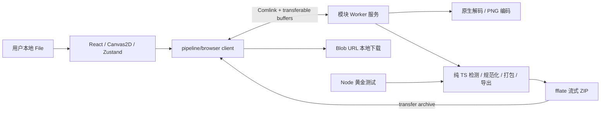

# SpriteFlow M1 架构定版

> 版本：1.0.0-r2（文档修订）；日期：2026-09-16；角色：架构师 R3；状态：第 1 轮问题修复，提交 Gate 1 第 2 轮复审。  
> 全文依据已通读的 `technical-design.md`，M1 范围以其第 9 节及本次用户明确交付要求为准。公共 API 唯一规范为 [interface-contract.md](./interface-contract.md)。本交付不包含功能实现、项目脚手架或部署。

## 1. 决策摘要与范围

定版为 pnpm workspace：一个纯 TS 管线包、一个 React 浏览器应用、独立黄金测试工作区。所有解码、像素、编码和归档运算在浏览器 Worker 内；Node 只用于开发与 CI。生产托管只发布静态文件，没有 API、账号、数据库、素材上传、模型服务或服务端授权校验。

M1 做静态透明 PNG/WebP、网格与 8 连通域、手动网格/矩形审校、trim/透明留边/统一画布、MaxRects、Phaser JSONHash/JSONArray、Godot PNG 序列+构建脚本，以及用户明确要求的 PNG 序列 ZIP/通用 JSON API。高级规范化、重复帧折叠、抠图、GIF/APNG/视频抽帧、输入 ZIP、付费授权不进入 M1。

以下细化防止把技术方案的跨里程碑描述误当 M1 必须交付：

| 议题 | M1 定版及原因 |
|---|---|
| ImageData 与纯算法 | 核心接收等价结构 PixelBuffer，不依赖浏览器全局 ImageData；浏览器/Node 解码分别适配 |
| Worker × N | M1 一个有状态 Worker，单任务；避免 4K/8K 原图在多 Worker 各复制一份。多 Worker 留到批量场景 |
| pHash / dHash | 公共字段 pHash 是带 algorithm 的容器，M1 计算 dhash64-v1 元数据；不做自动去重。避免方案中两个名称混用 |
| 统一画布 / 尺寸归一 | M1 统一逻辑透明画布，不缩放主体；质心/底边锚点、自动缩放留后续 |
| 尺寸聚类 / 离群 | 做几何后处理与flags；按最新PRD F-18暴露尺寸异常角标/筛选，不自动排除或修复，不承诺识别语义错误 |
| MaxRects 启发式 | maxrects-packer 2.7.3仅有MAX_EDGE=1、MAX_AREA=0，分别对应max-edge/max-area；删除未实现的fill-width，不承诺第三种选项 |
| Godot 资源 | ZIP 中提供自行编写的 EditorScript，在用户 Godot 工程里生成 .tres；Web 不手写 .tres，不执行引擎 |
| 用户反馈 | M1 不实现原方案第 7 节的匿名图片上传。用户自行选择在外部渠道分享，不增加后台 |
| ffmpeg / ONNX | 本次用户明确 M1 禁止，全部不安装、不预加载、不放静态资源或依赖树 |

执行目录为实际存在且 README 指定的 `D:\projects\new_project1`。提示词中的 `D:\projects\new\_project1` 不存在，本次未创建第二份仓库。首轮只交付两份架构文档；本轮依据用户“逐条修复后重新交付”的明确指示，额外定点修订agent-roles.md所有权/交接要求及根.gitignore，不修改业务代码、PM文档或独立验收裁决。

## 2. 仓库结构与所有权

以下是待工程师实现的定版结构，不代表目录已经建立。

```text
/
  package.json                 # private; packageManager=pnpm@11.9.0
  pnpm-workspace.yaml          # packages/*, apps/*, tests/golden
  pnpm-lock.yaml
  tsconfig.base.json
  biome.json
  .npmrc                       # auto-install-peers=false; save-exact=true
  .github/workflows/ci.yml
  docs/
    technical-design.md
    architecture-m1.md
    interface-contract.md
  packages/pipeline/           # name=@spriteflow/pipeline
    package.json
    tsconfig.json              # core: ES2022, no DOM
    tsconfig.browser.json      # browser/worker adapters only
    src/
      index.ts                 # pure public exports
      types.ts                 # contract declarations, single source
      input/                   # structure/limits/alpha validation
      detection/               # mask, projection, grid, CCL, grouping
      normalization/           # trim, canvas, flags, hash
      packing/                 # maxrects adapter + layout validation
      export/                  # JSON/Godot templates/ZIP, codec injection
      runtime/                 # cancellation token, progress, memory ledger
      browser/
        index.ts               # /browser exports only
        codec.ts               # native decode/PNG encode
        service.ts             # in-worker state and RPC implementation
        client.ts              # Comlink, transfer, pending tasks
    tests/                     # algorithm, API, transport contract tests
    BENCH.md
  apps/web/                    # name=@spriteflow/web
    src/
      app/                     # application flow
      editor/                  # Canvas2D viewport and rectangle tools
      store/                   # Zustand + zundo
      i18n/                    # zh-CN/en typed dictionaries
      workers/pipeline.worker.ts
    public/
      THIRD_PARTY_NOTICES.txt
    tests/                     # component tests, mocked client only
  tests/golden/                # name=@spriteflow/golden; no app imports
    package.json
    README.md
    cases/<caseId>/
      input.png
      ground-truth.json
      source.json              # source/author/license/permission evidence
    tools/                     # deterministic fixture generator + runner
    reports/                   # gitignored CI artifacts
  tests/e2e/                   # QA plans/fixtures first; no runtime dependency
```

依赖方向固定为 `apps/web → @spriteflow/pipeline/browser → @spriteflow/pipeline`、`tests/golden → @spriteflow/pipeline`。核心不能 import React/Zustand/Comlink/DOM；browser 子入口不能反向 import apps/web。代码不得从其他包 src 的相对路径绕过 exports，根入口不能 barrel-export browser 代码造成 DOM 类型或原生调用泄漏。

管线包只发布 ESM + `.d.ts`，根 exports 为 `.` 和 `./browser`，`sideEffects:false`；编译输出 dist，避免前端直接引用管线源码导致测试构建语义漂移。初期不发布 npm，workspace 使用 `workspace:*`。共享类型全部属于 pipeline；前端不能复制一份 Frame/错误枚举并自行演化。

R4负责packages/pipeline全部（含browser adapter）；R5负责apps/web（含Worker启动文件）；R6负责tests/golden、tests/e2e。**R7为根级唯一集成人**，除.github与部署配置外，独占维护根package.json、pnpm-workspace.yaml、pnpm-lock.yaml、tsconfig.base.json、biome.json、.npmrc、README.md、.gitignore及docs/devops.md。docs/technical-design.md与docs/agent-roles.md归产品主，其他角色只能提出修改建议或按产品主明确委托修改。这些归属已落实到[角色所有权表](./agent-roles.md)，不再作为待裁决建议。

R7根级工程初始化前置到Wave2开工前，完整CI/部署仍在Wave3；各包owner向R7提交依赖与共享脚本需求，禁止两人同时改写根lockfile。根.gitignore已忽略tests/golden/reports/；测试数据cases/、ground-truth和生成器仍须跟踪，报告按CI artifact保留策略处理。

## 3. 技术栈和最小直接依赖

选择已实际查询 npm 精确版本、peer 范围相容的组合，而不是使用 latest 浮动安装。运行 Node 固定 24.12.0，pnpm 固定 11.9.0；TypeScript 固定 5.9.3，暂不在 M1 引入 TS 7/新打包器的迁移变量。Vite 7 + React 插件 5 + Vitest 4 为本次验证的开发组合，更新先过 license/peer/回归门禁。

| 放置位置 | 依赖 | 精确版本 | 理由 |
|---|---|---|---|
| apps/web dependencies | react | 19.3.0 | 对齐 React 19 架构，无 SSR/Server Components |
| apps/web dependencies | react-dom | 19.3.0 | 与 react 完全同版 |
| apps/web dependencies | zustand | 5.0.15 | 小型应用状态；只用普通 create，不用 traditional/immer 可选链 |
| apps/web dependencies | zundo | 2.3.0 | 已声明支持 Zustand 4/5；历史只选取审校数据 |
| apps/web dependencies | comlink | 4.4.2 | Worker 启动文件 expose；与 pipeline/browser 使用同版单实例 |
| pipeline dependencies | comlink | 4.4.2 | browser 子入口实现通信；核心入口不可加载 |
| pipeline dependencies | maxrects-packer | 2.7.3 | 无运行时依赖，已有 MaxRects 与多页/旋转能力 |
| pipeline dependencies | fflate | 0.8.3 | ZIP 与解压测试，Worker 内单线程分块归档 |
| apps/web devDependencies | vite | 7.3.1 | 静态构建、模块 Worker、按需加载 |
| apps/web devDependencies | @vitejs/plugin-react | 5.1.2 | React JSX/Fast Refresh，与 Vite 7 peer 匹配 |
| root devDependencies | typescript | 5.9.3 | 严格类型与声明构建，各 workspace 共用 |
| root devDependencies | @biomejs/biome | 2.3.11 | lint/format 合一；不叠加 ESLint/Prettier 依赖链 |
| root devDependencies | vitest | 4.0.18 | core 单测、组件测试、golden 共享 runner |
| root devDependencies | @types/node | 24.10.1 | Node 24 工具/测试类型，不泄漏至核心 API |
| apps/web devDependencies | @types/react | 19.3.0 | 与 React 19 语义一致 |
| apps/web devDependencies | @types/react-dom | 19.3.0 | 与对应 React 类型一致 |
| apps/web devDependencies | @testing-library/react | 16.3.3 | 用户交互级组件断言 |
| apps/web devDependencies | @testing-library/dom | 10.4.2 | 上项与 user-event 必需 peer，显式声明 |
| apps/web devDependencies | @testing-library/user-event | 14.6.7 | 多选/拖动之外的键盘、确认、表单状态 |
| apps/web devDependencies | jsdom | 26.1.0 | 组件 DOM 环境；Canvas/Worker 不用 jsdom 假装真实支持 |
| tests/golden devDependencies | pngjs | 7.0.0 | Node PNG 夹具读写，纯 JS，无原生 canvas/sharp |
| tests/golden devDependencies | @types/pngjs | 6.0.5 | PNG 测试适配器类型 |

共 21 个唯一直接 npm 包。Comlink 重复出现在两个包 manifest，但审计按 name@version 只计一次。`@spriteflow/pipeline`、web、golden 是自有私有 workspace，不属于第三方许可证授权。

基础 i18n 用 TypeScript 字典和 `keyof` 类型，不需要 i18next/react-i18next；M1 单页不引入 router；UI 使用 CSS/Canvas2D，不引入 Konva、Pixi、UI 大组件库或图标字体。Node 内建 assert/fs/crypto/zlib 能解决的测试工具不增依赖。Phaser/Godot 只是输出格式及外部验收目标，不打进产品运行时。

暂不安装 Playwright 浏览器包、coverage 插件、license 扫描器、模型、WASM 编解码、pnpm 可选 peer（canvas、immer、use-sync-external-store 等）。QA M1 先给 E2E 计划/夹具，真实浏览器/引擎验收使用本地已安装工具；若后续要自动化引入包，先补审计、精确版本和 lockfile 再接 CI。此边界不免除真实 Worker/引擎冒烟验收。

来源：[zundo 2.3.0 发布说明](https://github.com/charkour/zundo/releases/tag/v2.3.0)、[Comlink 官方 README](https://github.com/GoogleChromeLabs/comlink/blob/main/README.md)、[MaxRects 官方说明](https://github.com/soimy/maxrects-packer/blob/v2.7.3/README.md)。逐包版本与许可证据见第 8 节及附录。

## 4. 运行时架构与线程职责



主线程只持有原 File、最大边 1024 预览/有限视口 tile 缓存、帧小对象与编辑历史，不执行像素循环、CCL、图集像素拼接或 ZIP。Worker 存一份 canonical RGBA；每个任务临时申请工作数组，结束即清理。应用网络只请求本站静态资源，Worker 同源模块 URL，生产 CSP 可用 `connect-src 'none'; worker-src 'self'`（部署角色结合其他静态资源策略实测），不使用 blob Worker 或远程脚本。

### 4.1 接口与缓存

Worker 暴露 init/execute/cancel/dispose 四个方法。execute 的 command 为 load、detect、preview、normalize、pack、export、release；请求/响应带 protocolVersion/taskId/command，检测、帧、打包结果统一为契约中的 DTO。预期业务错误用 Outcome，降级用 DetectResult.degraded+warning。禁止依赖跨线程自定义 Error 原型或 stack。

资产引用由 assetId+revision 组成；normalize 成功生成 normalizationId，pack 成功生成 packId。导出绑定这两个结果和资产，不接受旧布局配新帧。对缓存的提交是原子操作：失败或取消不覆盖上一份成功结果。无跨 Worker 状态共享，无后端 session。Worker 崩溃时 UI 保留 File/草稿，重建并重新导入；result ID 全失效。

Comlink.transfer 总是包住完整 RPC 请求/响应，transfer list 精确列出仅供接收端持有的 ArrayBuffer；主线程发送后视图 detach，不能拿原 buffer 重试。Worker 持有的源 RGBA 不传回；只传新建缩略图、预览或最终 ZIP。callback 用 Comlink.proxy，任务结束由Worker释放其持有的回调远程代理，客户端清理监听。具体传输所有权、返回类型与取消竞态以契约第 9 节为准。[Comlink 的 transfer/proxy/releaseProxy 说明](https://github.com/GoogleChromeLabs/comlink/blob/main/README.md)是底层依据。

### 4.2 取消与滑杆重算

取消不是发消息后就终止同步循环：算法每≤16ms或64行 yield 到宏任务队列并检查 token；短微任务 yield 不够。进度按处理行、帧、页面、已插入矩形计数，50ms 节流，原生编解码只显示真实开始/完成。cancel 等待终态后再调新任务；2 秒未结算则 terminate 并恢复 UI 草稿。细粒度 CPU 循环取消延迟 p95≤100ms，原生 decode/encode 按 2 秒强制终止边界验收。

侧栏 300ms 防抖；对连拖只保留最后一个待执行参数。preview 可用≤1024 分析图做近似结果，final 必须原图校验/细化。UI 不准把 preview 的帧直接用于 pack/export，不准把旧请求结果覆盖新草稿。渲染中的帧框与检测中的候选层分离，重算完成才原子应用一组帧。

### 4.3 审校状态

Zustand 分四类：文档草稿（帧框/顺序/选中属性）、视口（缩放/平移）、任务（taskId/阶段/进度）、资源句柄（File/preview/Worker client）。zundo 只 partialize 文档草稿和规范化选项，最多 100 个逻辑事务；像素、缓存、运行状态不进入历史。一次拖动只提交一次；撤销/重做将 normalizationId/packId 标为过期。Canvas 大图渲染使用源坐标→viewport 变换，DPR 只影响显示，导出始终整数工作图像坐标。

Canvas2D 视口可显示 8K 文件的缩略预览并按需请求可见区域细节，不能创建与原图一样大的多个 backing canvas。处理内存不够时给明确降采样选择，用户同意前不改分辨率。画布查看、算法检测与导出是不同资源预算，8K“可浏览”不意味着一切算法都能无条件在 8K 上完成。

## 5. 性能与内存预算

以下均是**实现验收预算，不是本次已测成绩**。基准固定：桌面 Intel i5-1240P 或性能相当、16 GiB RAM、交流电供电、无 CPU 限速；Node 24.12.0 与本机稳定 Chromium 分别记录精确版本/OS。用 4096×4096（16,777,216 像素）定义“4K”，不把 3840×2160 的较小输入混为同一结果。设备规格需在 BENCH.md 记录；不能用 CI 不稳定虚机耗时当产品性能结论。

### 5.1 模块预算

| 模块 / 输入 | p95 预算 | 测量范围与分解 |
|---|---|---|
| 首屏 JS | <300 KiB gzip | HTML 静态依赖闭包，去重累计；React/编辑器≤220 KiB，状态/i18n≤30 KiB，入口/胶水余量≤50 KiB |
| 延迟 Worker JS | ≤180 KiB gzip 目标 | 单独报告，不计入未启动处理的首屏；不能以懒加载名义隐藏已预加载依赖 |
| 4K 透明输入解码 | ≤350ms 目标 | 头部校验/预算20、原生解码与读回280、预览50；浏览器差异单独记录 |
| 4K mask/原图投影 | ≤70ms | alpha扫描与行列统计复用一次扫描；不重复来回复制全图 |
| 网格探测与原图验证 | ≤100ms | 缩略探测30、周期/槽分析20、原图cell验证50；不含上项 |
| **4K 连通域整段** | **<500ms** | mask 45、膨胀60、两遍CCL与并查集220、原始bbox/面积回收65、过滤/近邻合并/簇60、调度余量40；合计490ms |
| 规范化 + hash / ≤500帧、累计≤4K像素 | ≤150ms | trim/flags/逻辑画布100，确定性hash50；不分配所有帧 RGBA 常驻副本 |
| 打包500帧 | <200ms | 参数/排序20、插入及多页布局140、验证/输出20、yield余量10；合计190ms，不含像素渲染/编码 |
| 4K 图集绘制 + extrude | ≤150ms | 逐页申请/释放，copy/rotate/extrude 本地 Worker 循环 |
| 单4K PNG编码 | ≤900ms 目标 | 原生convertToBlob，不能借不可取消时间伪造进度 |
| ZIP组装≤64MiB PNG+JSON | ≤250ms 目标 | PNG store、文本deflate，分块写入/取消 |
| 代表样例上传至审校可用 | p50≤2s、p95≤3s 目标 | 含解码、最坏auto两策略、规范化；不含人的审校时间 |
| 滑杆preview / 最大边1024 | ≤150ms | 不含300ms防抖；final随停止调节执行 |
| 处理期间UI交互 | p95帧耗时≤16.7ms；无>50ms处理长任务 | 主线程 trace；避免大量候选标记一次性 DOM 更新 |

CCL <500ms 单独计时包括有效 grouping 后处理，不只挑最短的标签循环；表中 mask/投影与 CCL mask 是不同路径的测量边界，同一次运行可复用，报告不能重复加计。最坏棋盘/密集小点压力样本另报，不能以可无限低面积阈值仍恒定500ms作不实承诺；遇到资源/帧上限必须按契约降级或报错，不挂死。

先 warmup 5 次，独立测量 30 次，p95 取排序后第 ceil(.95×n) 项；记录 min/median/p95 与样本 hash。检测/打包微基准排除磁盘IO和首次 import，端到端基准包括编解码。每轮清理缓存，输入与 options 固定。QA 可加入 Node benchmark 并保留基线，但共享 CI 中仅把明显回归（参考基线2倍）作为诊断信号；发布性能门禁在相同参考设备重测。

### 5.2 内存分解与拒绝边界

| 资源 | 4096² | 8192² | 生命周期 |
|---|---|---|---|
| 单份RGBA | 64 MiB | 256 MiB | Worker持有到release |
| Uint8 mask | 16 MiB | 64 MiB | 检测阶段临时 |
| Uint32 labels | 64 MiB | 256 MiB | CCL阶段临时；绝不能用Uint8存标签 |
| 第二mask / union数组 / bbox统计 | 按算法峰值计 | 按算法峰值计 | 在分配前计入ledger，不按“只需RGBA”估算 |
| ≤1024预览RGBA | ≤4 MiB | ≤4 MiB | 主线程，最多有限LRU |
| 一页RGBA + PNG缓冲 + ZIP | 随输出大小 | 随输出大小 | 逐页编码后释放RGBA，ZIP返回只保留一份 |

技术方案“8192² RGBA≈268MB”只是一份像素的十进制大小，并非总内存上限。本契约 desktop 预算1 GiB、mobile256 MiB；单纯检测保守预检 `16*N + 16 MiB`，解码 `12*N + encodedBytes +16 MiB`，与实际内存账本取较大值。4K CCL预估272 MiB；8K CCL预估1040 MiB会超 desktop 预算，必须给降采样选择。8K手动审校/预览按具体路径预算可用，不能借此跳过CCL检查。移动端4096只是尺寸硬上限，实际可能因256MiB预算需更小。

编码前预估源图、frame/page暂存、PNG最坏未压缩量、ZIP最终输出与归档拷贝，超限在 render 之前返回 MEMORY_LIMIT；单归档硬上限 desktop256MiB/mobile64MiB。捕获可识别分配失败，但浏览器进程被系统杀死不属于 JS 可恢复保证。主线程缓存≤32MiB，资源 ledger 应预留这部分和必要运行时余量；申请/释放与取消清理要有单测。

## 6. 测试策略

### 6.1 管线单测

R4 按模块先写可判定的输入输出测试；小图直接构造 TypedArray，不依赖 DOM/mock Canvas 绕过算法。随机压力用固定 seed 并把失败 seed 记入报告。逻辑坐标和结果精确断言，不以“没有抛错”充当质量测试。

必测组：

1. 输入：错误数组长度/offset、EXIF尺寸映射、alpha=threshold、99% opaque临界、全透明、损坏头部、动画标记、过大尺寸/内存；禁止未预检直接分配。
2. CCL：8连通对角点、超过255/65535个标签、边缘相连、面积等于阈值、膨胀0与自动半径、断件、链式合并、真实bbox不膨胀、不修改像素、帧数上限。
3. grid：单行/单列、非整除网格、透明槽断续、periodTolerance临界、0.9严格比较、多个连通域的cell标记、空cell保持与删除。
4. 降级：每个 DegradedReason、attempted顺序、confidence=0、手动网格实际帧、pending状态；显式manual-grid不是低置信度警告。
5. 规范化：trim关闭/开启、奇数余量、空帧、uniform/excluded帧、padding不越界、dHash位序/透明RGB、离群临界、中位数偶数规则、merged来源、重排保留ID。
6. pack：padding/extrude/border区分、POT上限、90°旋转恢复、两种heuristic的确定性排序与MAX_EDGE/MAX_AREA真实枚举映射、拒绝fill-width、空帧1×1占位、单页溢出/多页、oversized rectangle、重复名/保留名、未审校拒绝。
7. export：五个枚举分支、JSON完整结构、空帧/trim偏移/旋转像素、PNG复原、路径唯一、ZIP条目mtime、动画重复帧与顺序、Godot文件引用与安全转义、旧缓存结果拒绝。
8. 生命周期：cancel前/中/终态竞态、BUSY不排队、运行任务BUSY的details.field=task及retry、空闲但旧资产存在时details.field=asset及release-asset→retry、必须释放旧ref而非新ref、任务检查优先级、被detach缓冲须重建、任务只结算一次、progress单调、宏任务yield、旧revision拒绝、release/dispose幂等、Worker错误后Promise不悬挂；用 MessageChannel 测 clone/transfer真实detach，浏览器再验 Worker 适配器。

vitest node 环境覆盖核心；组件测试只 mock PipelineClient 的有限状态响应，验证前端状态机/手动降级/过期结果/撤销事务，不用 mock 得出算法性能结论。jsdom 无真实Worker/Canvas2D，不能计作运行时验收。API `expectTypeOf` 和编译 fixture 用于 discriminated union 的返回类型收窄；根入口在无DOM lib项目编译。

不新增覆盖率包作为M1最小依赖。每个规则都有命名测试，五个导出器和错误/降级枚举需分支清单100%覆盖；如后续需要行/分支覆盖率百分比，先审计相应vitest coverage插件，不能报一个未实际运行的覆盖率数字。

### 6.2 黄金集与标注格式

R6 的 runner 直接 import 纯API；使用 pngjs 解码为标准PixelBuffer。M1 初始门禁至少20例，首版固定20例用于20/20验收，之后只增不删。覆盖A透明网格、C散排、D单行、E透明叙事图；B不透明作为拒绝/降级边界夹具，不能要求M1去底。合成样例不含字体、远程图片或无法复现的随机噪声。

20例建议配额：规整网格4、单行/单列2、散排3、断件/近邻2、噪声2、cell多组件1、离群1、重复帧1、全透明1、单主体降级1、严重歧义降级1、非透明拒绝1。透明AI真实样例至少5张与1张Kenney表另作为端到端退出集，可纳入20例的同类位置。任何社区素材须保存明示授权证据；可浏览不等于可再分发；模型样例记录来源、生成条件与人工标注，不在CI调用付费/随机模型。

ground-truth schema 必须固定版本，建议如下（这是测试数据约定，不是管线新API）：

```ts
type GoldenExpectation =
  | {
      kind: "result";
      strategy: "grid" | "components" | "manual-grid";
      degradedReason: string | null;
      attempted: ("grid" | "components")[];
      frameCount: number;
      frames: {
        key: string;
        bbox: { x: number; y: number; width: number; height: number } | null;
        sourceRect: { x: number; y: number; width: number; height: number };
        flags: { outlier: boolean; merged: boolean; multipleComponents: boolean; empty: boolean };
      }[];
      order: "row-major" | "geometric";
    }
  | { kind: "error"; code: string };
interface GoldenCase {
  schemaVersion: "spriteflow-golden/1";
  id: string;
  category: string;
  input: "input.png";
  inputSha256: string;
  options: import("@spriteflow/pipeline").DetectOptions;
  expected: GoldenExpectation;
}
```

options 必须完整存档，即使全默认也写下完整展开值，防止默认变化后基线悄悄跟着变。所有golden quality=final。ground truth 由人工/合成几何写出，不从被测检测器输出反向生成“正确答案”。source.json 包含原始URL/许可标识/作者/获取日期/授权文件hash；生成夹具包含seed与生成器版本。SHA不匹配即失败，不能将数据错误误判为检测回归。

匹配与断言：

1. 先断言 Outcome 分支、strategy、degraded是否存在及reason、attempted；降级还断言manual-grid建议与pending状态。error类精确比较code，不要求不存在的Frame数组。
2. result类先断言 **frames.length === expected.frameCount**，也要等于标注frames.length。不要先过滤empty、outlier、excluded或“低置信度”帧再比较。
3. grid/manual-grid按row-major匹配，并检查顺序。components 不依赖编号：构造全对全 IoU 矩阵，以 `IoU > 0.9` 为候选边做一对一完美二分匹配（DFS增广即可，不添加算法依赖）。没有完美匹配则失败；不能使用贪心、平均IoU或一个预测框重复匹配多个标注。
4. 匹配后**每对 bbox IoU 严格 >0.9**，恰好0.9失败。bbox=null时必须empty=true且双方均null，改比sourceRect，不能把0/0 IoU当1；降级建议矩形按预期整数坐标精确比较。
5. flags 精确匹配对应标注，frame ID唯一、sourceRect在图内、canvas可容纳bbox、confidence范围、warning/degraded一致；无法检测的病例按降级标注验收，不让IoU要求抹掉诚实降级路径。
6. 输出JSON/JUnit报告、预测/标注overlay PNG与最小失败摘要；overlay由Node PNG像素绘制，失败时才保存，不带素材网络上传。报告列出每对框、IoU、误检/漏检、有效参数、实际策略与阈值。基线更新必须列差异和原因，CI不得自动接受新snapshot。

`pnpm golden` 在任何机器全量枚举、不得test.skip，缺输入或标注即失败。用例数下降、缺授权、hash变化而未更改标注版本、bbox不合法均先使harness失败。性能压力例单列，不用不稳定的时间断言污染几何golden。

### 6.3 导出与真实浏览器/引擎验收

解ZIP后解析PNG像素，按PackedFrame.rotated/sourceSize/spriteSourceSize重建每个逻辑frame，与normalize后应有像素逐像素比对；这样同时抓到trim偏移、旋转方向、extrude错误。Phaser3.90的旋转frame.w/h为未旋转宽高，物理边界要交换宽高计算；通用JSON的rect直接为物理存储矩形，必须分别验证。JSONHash对象属性顺序不等于引擎播放顺序，播放顺序从 animations.json 或通用 frameOrder 校验。

至少在Chromium、Firefox、WebKit目标浏览器实际验证模块Worker/OffscreenCanvas能力；不支持的环境验证阻断信息，不能声称完整兼容。Phaser 3.90.0 用外部最小测试项目加载两种图集，播放有trim、旋转、空帧的动画；Godot4.4.x实际导入ZIP、执行脚本、打开生成SpriteFrames并播放。引擎版本与结果记入QA验收报告，生产包不带引擎。

## 7. CI 设计：五个 job

触发 push 与 pull_request；main 保护规则要求以下五个检查全部通过。按现有仓库流程可直接提交main，但CI失败必须阻断发布；不在本次架构交付执行git commit或部署。所有job从干净checkout开始，不依赖另一个job残留node_modules。

| job名称 | 必须执行 | 失败条件 / 产物 |
|---|---|---|
| lint | `pnpm lint` → Biome check + 包依赖边界静态检查 + docs契约代码块检查 | lint错误、非法跨包src import、core引入DOM/React/Comlink、禁用依赖；输出诊断 |
| typecheck | 先pipeline声明构建，再 `pnpm typecheck` → 各项目tsc --noEmit、核心无DOM fixture、契约调用示例 | strict/noUncheckedIndexedAccess/exactOptionalPropertyTypes任一错误、类型与公开exports不符 |
| unit | `pnpm test:unit` → pipeline node测试 + web jsdom组件测试 | 测试不通过或无测试退出；JUnit，取消/transfer测试不得skip |
| golden | `pnpm golden` → Node纯管线20例及导出回归 | 帧数/逐框IoU/降级/授权/manifest断言任一失败；JSON/JUnit与失败overlay |
| build | `pnpm build` → pipeline tsc、web Vite；license闭包校验、THIRD_PARTY_NOTICES、gzip预算与静态产物检查 | 构建warning/error、首屏≥300KiB、GPL或未知许可证、未审计版本、模型/服务端产物进入dist；上传dist与许可清单 |

共同设置：Node24.12.0、pnpm11.9.0、`pnpm install --frozen-lockfile --ignore-scripts`、禁止动态更新 lockfile。最小依赖当前原生工具直接使用已发布平台binary；若某平台确需安装脚本，逐包审核并显式放行，不能整体打开依赖脚本。CI使用Linux x64，开发Windows也须可构建；跨平台optional包全部纳入审计，不只看CI实际安装分支。

五个job可并行，各自按需构建pipeline。缓存仅pnpm store，键包含OS、Node主版本、pnpm版本、lockfile hash；不缓存构建结果代替测试。运行超时建议lint5m/typecheck5m/unit10m/golden10m/build10m；concurrency取消同分支旧运行，失败报告保留14天。Actions权限contents:read，第三方Action使用已审查commit SHA；具体SHA及Action许可由R7在CI配置首次落地时纳入构建工具清单，不在此虚构未选Action版本。

必须提供统一根脚本名 lint/typecheck/test:unit/golden/build。包名固定scoped，工程师使用 `pnpm --filter @spriteflow/pipeline test`，不要依赖模糊`-F pipeline`能否匹配。构建依赖通过workspace build顺序解决，不由前端复制管线dist。

本次文档阶段没有这五个可运行job；其通过状态只有代码落地后才能报告。本文验证的是类型声明可编译、选定包版本可解析、许可闭包可枚举与文档一致性。

2026-09-16文档交付检查结果：抽取契约8个根类型声明块，以TypeScript5.9.3、strict/noUncheckedIndexedAccess/exactOptionalPropertyTypes、lib=ES2022（不含DOM）编译通过；browser声明与完整调用示例加DOM lib编译通过；JSON示例可解析；附录A的213个唯一name@version与临时锁文件逐项双向比对无缺项/多项。检查文件只生成在系统临时目录，未增加业务代码或项目依赖安装。

## 8. 许可证审计方法、结论与发布义务

### 8.1 审计边界与证据

本次在**仓库外临时目录**用21个唯一直接包的精确版本、pnpm11.9.0、`auto-install-peers=false` 执行 lockfile-only 解析；没有在项目安装依赖或生成脚手架。闭包包含**213个name@version**，含直接、传递、开发/测试和跨平台optional包。查询每个精确版本的 npm registry metadata，下载其发布tarball并校验声明的SHA-512，读取LICENSE/LICENCE/COPYING/NOTICE；累计下载281,221,157字节，仅作审计，未运行任何依赖脚本。

附录A逐行列出全部213个包，不把“仅开发使用”当漏审理由。附录B额外逐行列出Vite、Vitest、Rollup在自身LICENSE及TypeScript在ThirdPartyNoticeText中声明的内嵌材料；它们不再作为独立npm依赖解析，上游未披露子版本时如实标为“随宿主精确版本锁定”，不编造数字。发布归档的许可证与内嵌NOTICE需要一起保留，不能只复制顶层MIT一段。

发布包中62个条目没有独立LICENSE文件，主要是平台binary；按其manifest声明及对应父包的完整许可证核对。saxes6.0.0补查[对应tag LICENSE](https://raw.githubusercontent.com/lddubeau/saxes/v6.0.0/LICENSE)；stackback0.0.2在发布package.json明示MIT、作者Roman Shtylman，发布包未附单独文本，工具链归档应同时保存该声明及MIT条款。`@napi-rs/lzma-linux-x64-gnu`1.5.1仅构建可选链、manifest明示MIT，不分发到Web产物；不能因为它未安装在Windows就漏掉Linux审计。

结论限定为：**本次选定npm闭包及已声明内嵌组件未发现GPL/AGPL/LGPL依赖；允许按下列义务用于商业闭源产品。** 这不是对未来更新、未落地CI Actions、外部引擎二进制或任何素材的自动授权。Node/pnpm为开发工具，见附录C；自有源码许可由产品主决定，不因使用MIT库自动要求开源。

### 8.2 风险分类与决定

| 许可证 | 闭源商用评估 | 固定发布义务 / 结论 |
|---|---|---|
| MIT | 无源代码公开要求；保留授权/版权义务 | 允许，发放对应许可证与copyright |
| MIT OR Apache-2.0 | 可选任一；本项目选择MIT路径 | 允许，保留MIT全文与版权，原包两份许可证可一起保存 |
| Apache-2.0 | 无闭源阻碍；有专利/修改声明/NOTICE要求 | 允许，保留LICENSE和适用NOTICE，修改上游文件须显著声明 |
| ISC | 宽松；保留版权与许可 | 允许，保留文本 |
| BSD-2-Clause / BSD-3-Clause | 宽松；后者禁止用作者名背书 | 允许，保留版权、条件及免责 |
| MIT-0 / 0BSD | 宽松，无常规署名条件 | 允许，仍保留来源记录 |
| CC-BY-4.0 | caniuse-lite是浏览器数据；须署名、链接许可、说明修改，无ShareAlike | 允许，仅构建数据；再分发该数据时随附来源与修改说明 |
| CC0-1.0 | 内嵌string-hash使用，公有领域贡献/许可兜底 | 允许，记录来源 |
| TypeScript内嵌Unicode/W3C/WHATWG/Khronos材料 | 类型/规范材料的单独通知，不因顶层Apache-2.0而消失；未见GPL义务 | 允许仅按附录B范围用于工具链，保留完整ThirdPartyNoticeText及署名/修改/专利条款；不单独抽取规范再许可 |

依据：[MIT原文](https://opensource.org/license/mit)、[Apache-2.0原文](https://www.apache.org/licenses/LICENSE-2.0)、[CC BY 4.0义务](https://creativecommons.org/licenses/by/4.0/)。附录中风险简写均指本表，不代表“无任何义务”。

M1明确排除`@ffmpeg/ffmpeg`、`@ffmpeg/core`及其他FFmpeg封装/二进制、`onnxruntime-web`/`onnxruntime-node`/模型、pngquant/jSquash、GIF解码器、视频demuxer。理由分别是里程碑越界及FFmpeg/pngquant可能随构建/组件引入copyleft，不笼统误称所有FFmpeg wrapper或ONNX都采用GPL。未来阶段需要重新审计构建配置、模型权重和其许可；M1不得通过CDN或动态import绕过禁用清单。

### 8.3 从设计审计到可发布锁文件

R7首次集成将本表的直接版本写成精确版本（无^/~），提交pnpm-lock.yaml及依赖清单；闭包必须与附录A的name@version集合一致。若重新解析得到不同传递版本，可先按审计版本添加**兼容范围内**overrides重现；不能强制不兼容版本只为凑集合，遇到差异回到架构审计更新。临时解析不是项目正式lockfile，不声称依靠直接精确版本就能冻结传递依赖。

build job完整扫描lockfile的packages区和安装发布包许可，按name@version去重，将实际集合与审计清单做双向diff；缺项/多项/UNKNOWN/UNLICENSED/SEE LICENSE IN未解析、非批准SPDX分支均失败。许可表达式要按AND/OR解释，不做包含“MIT”就放行的字符串搜索；GPL/AGPL/LGPL依赖无论prod/dev/optional均拒绝。正式lockfile解析后的integrity与发布tarball再核对，审计更新同时保存锁文件hash和许可文本hash。

发布dist必须带`THIRD_PARTY_NOTICES.txt`，覆盖所有实际分发运行时代码及Vite注入helper的上游声明；源码仓库/CI审计artifact保留完整开发闭包与内嵌声明。fonts/icons/sample images不用未审计外部资源。依赖更新、版本override、CI工具变化或新增静态二进制/模型都触发重新审计，不能把本次“许可通过”当无限期通行证。

## 9. 跨角色对齐结果与 UI 交接

首轮验收后，当前PRD/copy已由其他角色修订。本轮读取其最新内容并同步架构，不回退或覆盖这些修改；以当前文档明确的范围消除首轮差异：

1. 五个ExportFormat继续为公共API；当前PRD第1.1节与“不做”清单已明确M1 UI只暴露Phaser JSON Hash、Phaser JSON Array、Godot三个入口，PNG序列ZIP/通用JSON不新增UI入口。
2. 透明度判定已统一为完全不透明像素占比严格>99%拒绝，恰好99%允许。当前PRD AC-F02与文案error.opaque已修订，契约保持相同边界。
3. PRD使用atlas.png/atlas.json与frame_000命名。契约允许API baseName，前端默认传atlas；帧默认使用三位序号并稳定保留name，排序改变展示编号/播放顺序，不强制改名（避免动画引用断开）。
4. 验收问题2采用其给出的方案（b）：当前PRD F-18/AC-F18已纳入三个角标、筛选及确认，copy-m1.md已提供review.badge.outlier、review.filter.outlier等完整双语词条；契约第8节据此明确显示离群角标，不能再写“M1离群UI不暴露”。M1仍不显示dHash数值、不自动折叠/排除/修复帧、不承诺语义质量检测。
5. 根配置与docs/devops.md归R7、技术方案与角色权限归产品主，已在第2节及agent-roles.md落盘；根.gitignore已增加报告目录规则。

ui-spec.md属于Wave2，目前尚不存在；本轮没有创建未经UI角色设计的占位规范。以下状态清单已同时写入R2角色交接要求，作为其后续ui-spec验收必查项：

| UI状态/操作 | 必须行为 | 现有copy词条 |
|---|---|---|
| 尺寸异常/可能粘连/空帧 | 按outlier/multipleComponents/empty显示，可同时出现，不更改included或顺序 | review.badge.outlier / multiple_components / empty |
| 全部/全部待复核/各类筛选 | 全部待复核=三类flags的逻辑或，与reviewStatus独立；只筛显示，不删改导出数据 | review.filter.all / attention / outlier / multiple_components / empty |
| 筛选无结果 | 提示空状态，允许清除筛选，不改帧数组 | review.filter.none |
| 尚未确认 | 展示待确认数量，导出按REVIEW_REQUIRED返回审校 | review.pending / export.review_required.* |
| 确认后 | accepted，可导出，flags与角标继续保留，不自动修复/折叠 | review.confirmed / tool.confirm_review |

这是当前PRD的设计交接，不等同于ui-spec已编写或Gate2已通过。并行双方以同一版r2接口契约开工；正式冻结后的协议更改集中回到架构师修订，经原Gate流程同步，禁止单方临时加字段。

## 10. 第 1 轮验收问题整改索引

来源：[architecture-verdict-1.md](./acceptance/architecture-verdict-1.md)。该裁决保留原样，以下为生产者整改说明，不自行改判PASS。契约尚未发布/冻结，本次文档r2替代首轮候选全文，目标契约1.0.0与协议1不变；无需迁移既有生产客户端。

| 编号 | 级别 | 本轮修复 | 核验依据 |
|---|---|---|---|
| 1 | P1 | R7根级唯一集成人、docs/devops.md所有权、产品主对technical-design/agent-roles修订权均已落盘；R7初始化前置Wave2 | agent-roles所有权表/R7职责及本文第2节，不再含“待指定根owner” |
| 2 | P1 | 按当前PRD/copy采取方案（b），契约明确离群UI边界与所有状态，R2增加ui-spec承接要求 | PRD F-18/AC-F18、copy review.*、契约第8节、本文第9节；ui-spec实际实现留Wave2 |
| 3 | P1 | 删除fill-width合法值；max-edge→MAX_EDGE=1、max-area→MAX_AREA=0，补齐排序/非法值规则 | 固定版本源码枚举、sort与findNode分支；契约第5节及类型负例检查 |
| 4 | P2 | BUSY按task/asset区分，新增release-asset恢复动作，明确release旧ref后重新提供buffer再load | 契约第8/9.2节、RecoveryAction类型与生命周期测试要求 |
| 5 | P2 | 根.gitignore实际增加tests/golden/reports/ | git check-ignore验证报告命中、golden夹具不被该规则忽略 |

问题3核验发现README与固定版本代码不一致，今后第三方行为以实际采用版本的类型声明/源码为准。本次未新增或升级依赖，附录A/B及许可版本集合保持不变；未实现任何业务功能，也未伪报运行时/性能或独立复审通过。

本轮已完成的验证（2026-09-16）：

- TypeScript5.9.3严格编译：8个根声明块（ES2022、无DOM）、browser声明与完整调用示例均通过；类型正例接受max-edge/max-area与release-asset，`@ts-expect-error`负例确认fill-width不再合法。
- 五项文档检查通过：责任路径逐项有owner、PRD F-18与全部所需review/copy词条对应、合法枚举无第三选项、BUSY两种field及恢复动作一致、ignore规则已落盘。
- `git check-ignore -v`确认reports内JSON及PNG命中规则，cases内PNG/ground-truth保持可跟踪；本轮修改的已跟踪文件通过`git diff --check`。
- 许可附录相对本轮开始的快照逐字一致，213个name@version条目齐全；原验收裁决逐字不变。PRD/copy在本轮期间由其他角色继续更新，本轮仅重新读取并检查一致性，没有改写其文件。

这些检查验证文档与配置修复；运行时取消/导出、CI五job和引擎冒烟仍待工程实现后执行。复审入口为本节五项索引和契约第12节，不把生产者自查等同于独立验收通过。

## 附录 A：完整 npm 依赖许可证审计表

审计日期2026-09-16。来源列链接精确发布元数据，含license、dist.tarball及integrity；包内授权证据按第8节核对。每个name@version一行，包含全部平台optional包；“低”风险仍需履行第8.2节对应义务。

| 名称 | 版本 | 许可证 | 商用闭源风险评估 | 结论 | 精确版本证据 |
|---|---|---|---|---|---|
| `@asamuzakjp/css-color` | 3.2.0 | MIT | 低；保留版权/许可 | 允许；遵守第8.2节 | [元数据](https://registry.npmjs.org/%40asamuzakjp%2Fcss-color/3.2.0) |
| `@babel/code-frame` | 7.29.7 | MIT | 低；保留版权/许可 | 允许；遵守第8.2节 | [元数据](https://registry.npmjs.org/%40babel%2Fcode-frame/7.29.7) |
| `@babel/compat-data` | 7.29.7 | MIT | 低；保留版权/许可 | 允许；遵守第8.2节 | [元数据](https://registry.npmjs.org/%40babel%2Fcompat-data/7.29.7) |
| `@babel/core` | 7.29.7 | MIT | 低；保留版权/许可 | 允许；遵守第8.2节 | [元数据](https://registry.npmjs.org/%40babel%2Fcore/7.29.7) |
| `@babel/generator` | 7.29.8 | MIT | 低；保留版权/许可 | 允许；遵守第8.2节 | [元数据](https://registry.npmjs.org/%40babel%2Fgenerator/7.29.8) |
| `@babel/helper-compilation-targets` | 7.29.7 | MIT | 低；保留版权/许可 | 允许；遵守第8.2节 | [元数据](https://registry.npmjs.org/%40babel%2Fhelper-compilation-targets/7.29.7) |
| `@babel/helper-globals` | 7.29.7 | MIT | 低；保留版权/许可 | 允许；遵守第8.2节 | [元数据](https://registry.npmjs.org/%40babel%2Fhelper-globals/7.29.7) |
| `@babel/helper-module-imports` | 7.29.7 | MIT | 低；保留版权/许可 | 允许；遵守第8.2节 | [元数据](https://registry.npmjs.org/%40babel%2Fhelper-module-imports/7.29.7) |
| `@babel/helper-module-transforms` | 7.29.7 | MIT | 低；保留版权/许可 | 允许；遵守第8.2节 | [元数据](https://registry.npmjs.org/%40babel%2Fhelper-module-transforms/7.29.7) |
| `@babel/helper-plugin-utils` | 7.29.7 | MIT | 低；保留版权/许可 | 允许；遵守第8.2节 | [元数据](https://registry.npmjs.org/%40babel%2Fhelper-plugin-utils/7.29.7) |
| `@babel/helper-string-parser` | 7.29.7 | MIT | 低；保留版权/许可 | 允许；遵守第8.2节 | [元数据](https://registry.npmjs.org/%40babel%2Fhelper-string-parser/7.29.7) |
| `@babel/helper-validator-identifier` | 7.29.7 | MIT | 低；保留版权/许可 | 允许；遵守第8.2节 | [元数据](https://registry.npmjs.org/%40babel%2Fhelper-validator-identifier/7.29.7) |
| `@babel/helper-validator-option` | 7.29.7 | MIT | 低；保留版权/许可 | 允许；遵守第8.2节 | [元数据](https://registry.npmjs.org/%40babel%2Fhelper-validator-option/7.29.7) |
| `@babel/helpers` | 7.29.7 | MIT | 低；保留版权/许可 | 允许；遵守第8.2节 | [元数据](https://registry.npmjs.org/%40babel%2Fhelpers/7.29.7) |
| `@babel/parser` | 7.29.8 | MIT | 低；保留版权/许可 | 允许；遵守第8.2节 | [元数据](https://registry.npmjs.org/%40babel%2Fparser/7.29.8) |
| `@babel/plugin-transform-react-jsx-self` | 7.29.7 | MIT | 低；保留版权/许可 | 允许；遵守第8.2节 | [元数据](https://registry.npmjs.org/%40babel%2Fplugin-transform-react-jsx-self/7.29.7) |
| `@babel/plugin-transform-react-jsx-source` | 7.29.7 | MIT | 低；保留版权/许可 | 允许；遵守第8.2节 | [元数据](https://registry.npmjs.org/%40babel%2Fplugin-transform-react-jsx-source/7.29.7) |
| `@babel/runtime` | 7.29.7 | MIT | 低；保留版权/许可 | 允许；遵守第8.2节 | [元数据](https://registry.npmjs.org/%40babel%2Fruntime/7.29.7) |
| `@babel/template` | 7.29.7 | MIT | 低；保留版权/许可 | 允许；遵守第8.2节 | [元数据](https://registry.npmjs.org/%40babel%2Ftemplate/7.29.7) |
| `@babel/traverse` | 7.29.8 | MIT | 低；保留版权/许可 | 允许；遵守第8.2节 | [元数据](https://registry.npmjs.org/%40babel%2Ftraverse/7.29.8) |
| `@babel/types` | 7.29.8 | MIT | 低；保留版权/许可 | 允许；遵守第8.2节 | [元数据](https://registry.npmjs.org/%40babel%2Ftypes/7.29.8) |
| `@biomejs/biome` | 2.3.11 | MIT OR Apache-2.0 | 低；选择MIT并保留许可 | 允许；遵守第8.2节 | [元数据](https://registry.npmjs.org/%40biomejs%2Fbiome/2.3.11) |
| `@biomejs/cli-darwin-arm64` | 2.3.11 | MIT OR Apache-2.0 | 低；选择MIT并保留许可 | 允许；遵守第8.2节 | [元数据](https://registry.npmjs.org/%40biomejs%2Fcli-darwin-arm64/2.3.11) |
| `@biomejs/cli-darwin-x64` | 2.3.11 | MIT OR Apache-2.0 | 低；选择MIT并保留许可 | 允许；遵守第8.2节 | [元数据](https://registry.npmjs.org/%40biomejs%2Fcli-darwin-x64/2.3.11) |
| `@biomejs/cli-linux-arm64-musl` | 2.3.11 | MIT OR Apache-2.0 | 低；选择MIT并保留许可 | 允许；遵守第8.2节 | [元数据](https://registry.npmjs.org/%40biomejs%2Fcli-linux-arm64-musl/2.3.11) |
| `@biomejs/cli-linux-arm64` | 2.3.11 | MIT OR Apache-2.0 | 低；选择MIT并保留许可 | 允许；遵守第8.2节 | [元数据](https://registry.npmjs.org/%40biomejs%2Fcli-linux-arm64/2.3.11) |
| `@biomejs/cli-linux-x64-musl` | 2.3.11 | MIT OR Apache-2.0 | 低；选择MIT并保留许可 | 允许；遵守第8.2节 | [元数据](https://registry.npmjs.org/%40biomejs%2Fcli-linux-x64-musl/2.3.11) |
| `@biomejs/cli-linux-x64` | 2.3.11 | MIT OR Apache-2.0 | 低；选择MIT并保留许可 | 允许；遵守第8.2节 | [元数据](https://registry.npmjs.org/%40biomejs%2Fcli-linux-x64/2.3.11) |
| `@biomejs/cli-win32-arm64` | 2.3.11 | MIT OR Apache-2.0 | 低；选择MIT并保留许可 | 允许；遵守第8.2节 | [元数据](https://registry.npmjs.org/%40biomejs%2Fcli-win32-arm64/2.3.11) |
| `@biomejs/cli-win32-x64` | 2.3.11 | MIT OR Apache-2.0 | 低；选择MIT并保留许可 | 允许；遵守第8.2节 | [元数据](https://registry.npmjs.org/%40biomejs%2Fcli-win32-x64/2.3.11) |
| `@csstools/color-helpers` | 5.1.0 | MIT-0 | 低；无署名条件，保留来源 | 允许；遵守第8.2节 | [元数据](https://registry.npmjs.org/%40csstools%2Fcolor-helpers/5.1.0) |
| `@csstools/css-calc` | 2.1.4 | MIT | 低；保留版权/许可 | 允许；遵守第8.2节 | [元数据](https://registry.npmjs.org/%40csstools%2Fcss-calc/2.1.4) |
| `@csstools/css-color-parser` | 3.1.0 | MIT | 低；保留版权/许可 | 允许；遵守第8.2节 | [元数据](https://registry.npmjs.org/%40csstools%2Fcss-color-parser/3.1.0) |
| `@csstools/css-parser-algorithms` | 3.0.5 | MIT | 低；保留版权/许可 | 允许；遵守第8.2节 | [元数据](https://registry.npmjs.org/%40csstools%2Fcss-parser-algorithms/3.0.5) |
| `@csstools/css-tokenizer` | 3.0.4 | MIT | 低；保留版权/许可 | 允许；遵守第8.2节 | [元数据](https://registry.npmjs.org/%40csstools%2Fcss-tokenizer/3.0.4) |
| `@esbuild/aix-ppc64` | 0.27.7 | MIT | 低；保留版权/许可 | 允许；遵守第8.2节 | [元数据](https://registry.npmjs.org/%40esbuild%2Faix-ppc64/0.27.7) |
| `@esbuild/android-arm` | 0.27.7 | MIT | 低；保留版权/许可 | 允许；遵守第8.2节 | [元数据](https://registry.npmjs.org/%40esbuild%2Fandroid-arm/0.27.7) |
| `@esbuild/android-arm64` | 0.27.7 | MIT | 低；保留版权/许可 | 允许；遵守第8.2节 | [元数据](https://registry.npmjs.org/%40esbuild%2Fandroid-arm64/0.27.7) |
| `@esbuild/android-x64` | 0.27.7 | MIT | 低；保留版权/许可 | 允许；遵守第8.2节 | [元数据](https://registry.npmjs.org/%40esbuild%2Fandroid-x64/0.27.7) |
| `@esbuild/darwin-arm64` | 0.27.7 | MIT | 低；保留版权/许可 | 允许；遵守第8.2节 | [元数据](https://registry.npmjs.org/%40esbuild%2Fdarwin-arm64/0.27.7) |
| `@esbuild/darwin-x64` | 0.27.7 | MIT | 低；保留版权/许可 | 允许；遵守第8.2节 | [元数据](https://registry.npmjs.org/%40esbuild%2Fdarwin-x64/0.27.7) |
| `@esbuild/freebsd-arm64` | 0.27.7 | MIT | 低；保留版权/许可 | 允许；遵守第8.2节 | [元数据](https://registry.npmjs.org/%40esbuild%2Ffreebsd-arm64/0.27.7) |
| `@esbuild/freebsd-x64` | 0.27.7 | MIT | 低；保留版权/许可 | 允许；遵守第8.2节 | [元数据](https://registry.npmjs.org/%40esbuild%2Ffreebsd-x64/0.27.7) |
| `@esbuild/linux-arm` | 0.27.7 | MIT | 低；保留版权/许可 | 允许；遵守第8.2节 | [元数据](https://registry.npmjs.org/%40esbuild%2Flinux-arm/0.27.7) |
| `@esbuild/linux-arm64` | 0.27.7 | MIT | 低；保留版权/许可 | 允许；遵守第8.2节 | [元数据](https://registry.npmjs.org/%40esbuild%2Flinux-arm64/0.27.7) |
| `@esbuild/linux-ia32` | 0.27.7 | MIT | 低；保留版权/许可 | 允许；遵守第8.2节 | [元数据](https://registry.npmjs.org/%40esbuild%2Flinux-ia32/0.27.7) |
| `@esbuild/linux-loong64` | 0.27.7 | MIT | 低；保留版权/许可 | 允许；遵守第8.2节 | [元数据](https://registry.npmjs.org/%40esbuild%2Flinux-loong64/0.27.7) |
| `@esbuild/linux-mips64el` | 0.27.7 | MIT | 低；保留版权/许可 | 允许；遵守第8.2节 | [元数据](https://registry.npmjs.org/%40esbuild%2Flinux-mips64el/0.27.7) |
| `@esbuild/linux-ppc64` | 0.27.7 | MIT | 低；保留版权/许可 | 允许；遵守第8.2节 | [元数据](https://registry.npmjs.org/%40esbuild%2Flinux-ppc64/0.27.7) |
| `@esbuild/linux-riscv64` | 0.27.7 | MIT | 低；保留版权/许可 | 允许；遵守第8.2节 | [元数据](https://registry.npmjs.org/%40esbuild%2Flinux-riscv64/0.27.7) |
| `@esbuild/linux-s390x` | 0.27.7 | MIT | 低；保留版权/许可 | 允许；遵守第8.2节 | [元数据](https://registry.npmjs.org/%40esbuild%2Flinux-s390x/0.27.7) |
| `@esbuild/linux-x64` | 0.27.7 | MIT | 低；保留版权/许可 | 允许；遵守第8.2节 | [元数据](https://registry.npmjs.org/%40esbuild%2Flinux-x64/0.27.7) |
| `@esbuild/netbsd-arm64` | 0.27.7 | MIT | 低；保留版权/许可 | 允许；遵守第8.2节 | [元数据](https://registry.npmjs.org/%40esbuild%2Fnetbsd-arm64/0.27.7) |
| `@esbuild/netbsd-x64` | 0.27.7 | MIT | 低；保留版权/许可 | 允许；遵守第8.2节 | [元数据](https://registry.npmjs.org/%40esbuild%2Fnetbsd-x64/0.27.7) |
| `@esbuild/openbsd-arm64` | 0.27.7 | MIT | 低；保留版权/许可 | 允许；遵守第8.2节 | [元数据](https://registry.npmjs.org/%40esbuild%2Fopenbsd-arm64/0.27.7) |
| `@esbuild/openbsd-x64` | 0.27.7 | MIT | 低；保留版权/许可 | 允许；遵守第8.2节 | [元数据](https://registry.npmjs.org/%40esbuild%2Fopenbsd-x64/0.27.7) |
| `@esbuild/openharmony-arm64` | 0.27.7 | MIT | 低；保留版权/许可 | 允许；遵守第8.2节 | [元数据](https://registry.npmjs.org/%40esbuild%2Fopenharmony-arm64/0.27.7) |
| `@esbuild/sunos-x64` | 0.27.7 | MIT | 低；保留版权/许可 | 允许；遵守第8.2节 | [元数据](https://registry.npmjs.org/%40esbuild%2Fsunos-x64/0.27.7) |
| `@esbuild/win32-arm64` | 0.27.7 | MIT | 低；保留版权/许可 | 允许；遵守第8.2节 | [元数据](https://registry.npmjs.org/%40esbuild%2Fwin32-arm64/0.27.7) |
| `@esbuild/win32-ia32` | 0.27.7 | MIT | 低；保留版权/许可 | 允许；遵守第8.2节 | [元数据](https://registry.npmjs.org/%40esbuild%2Fwin32-ia32/0.27.7) |
| `@esbuild/win32-x64` | 0.27.7 | MIT | 低；保留版权/许可 | 允许；遵守第8.2节 | [元数据](https://registry.npmjs.org/%40esbuild%2Fwin32-x64/0.27.7) |
| `@jridgewell/gen-mapping` | 0.3.13 | MIT | 低；保留版权/许可 | 允许；遵守第8.2节 | [元数据](https://registry.npmjs.org/%40jridgewell%2Fgen-mapping/0.3.13) |
| `@jridgewell/remapping` | 2.3.5 | MIT | 低；保留版权/许可 | 允许；遵守第8.2节 | [元数据](https://registry.npmjs.org/%40jridgewell%2Fremapping/2.3.5) |
| `@jridgewell/resolve-uri` | 3.1.2 | MIT | 低；保留版权/许可 | 允许；遵守第8.2节 | [元数据](https://registry.npmjs.org/%40jridgewell%2Fresolve-uri/3.1.2) |
| `@jridgewell/sourcemap-codec` | 1.6.0 | MIT | 低；保留版权/许可 | 允许；遵守第8.2节 | [元数据](https://registry.npmjs.org/%40jridgewell%2Fsourcemap-codec/1.6.0) |
| `@jridgewell/trace-mapping` | 0.3.31 | MIT | 低；保留版权/许可 | 允许；遵守第8.2节 | [元数据](https://registry.npmjs.org/%40jridgewell%2Ftrace-mapping/0.3.31) |
| `@napi-rs/lzma-linux-x64-gnu` | 1.5.1 | MIT | 低；保留版权/许可 | 允许；遵守第8.2节 | [元数据](https://registry.npmjs.org/%40napi-rs%2Flzma-linux-x64-gnu/1.5.1) |
| `@rolldown/pluginutils` | 1.0.0-beta.53 | MIT | 低；保留版权/许可 | 允许；遵守第8.2节 | [元数据](https://registry.npmjs.org/%40rolldown%2Fpluginutils/1.0.0-beta.53) |
| `@rollup/rollup-android-arm-eabi` | 4.63.3 | MIT | 低；保留版权/许可 | 允许；遵守第8.2节 | [元数据](https://registry.npmjs.org/%40rollup%2Frollup-android-arm-eabi/4.63.3) |
| `@rollup/rollup-android-arm64` | 4.63.3 | MIT | 低；保留版权/许可 | 允许；遵守第8.2节 | [元数据](https://registry.npmjs.org/%40rollup%2Frollup-android-arm64/4.63.3) |
| `@rollup/rollup-darwin-arm64` | 4.63.3 | MIT | 低；保留版权/许可 | 允许；遵守第8.2节 | [元数据](https://registry.npmjs.org/%40rollup%2Frollup-darwin-arm64/4.63.3) |
| `@rollup/rollup-darwin-x64` | 4.63.3 | MIT | 低；保留版权/许可 | 允许；遵守第8.2节 | [元数据](https://registry.npmjs.org/%40rollup%2Frollup-darwin-x64/4.63.3) |
| `@rollup/rollup-freebsd-arm64` | 4.63.3 | MIT | 低；保留版权/许可 | 允许；遵守第8.2节 | [元数据](https://registry.npmjs.org/%40rollup%2Frollup-freebsd-arm64/4.63.3) |
| `@rollup/rollup-freebsd-x64` | 4.63.3 | MIT | 低；保留版权/许可 | 允许；遵守第8.2节 | [元数据](https://registry.npmjs.org/%40rollup%2Frollup-freebsd-x64/4.63.3) |
| `@rollup/rollup-linux-arm-gnueabihf` | 4.63.3 | MIT | 低；保留版权/许可 | 允许；遵守第8.2节 | [元数据](https://registry.npmjs.org/%40rollup%2Frollup-linux-arm-gnueabihf/4.63.3) |
| `@rollup/rollup-linux-arm-musleabihf` | 4.63.3 | MIT | 低；保留版权/许可 | 允许；遵守第8.2节 | [元数据](https://registry.npmjs.org/%40rollup%2Frollup-linux-arm-musleabihf/4.63.3) |
| `@rollup/rollup-linux-arm64-gnu` | 4.63.3 | MIT | 低；保留版权/许可 | 允许；遵守第8.2节 | [元数据](https://registry.npmjs.org/%40rollup%2Frollup-linux-arm64-gnu/4.63.3) |
| `@rollup/rollup-linux-arm64-musl` | 4.63.3 | MIT | 低；保留版权/许可 | 允许；遵守第8.2节 | [元数据](https://registry.npmjs.org/%40rollup%2Frollup-linux-arm64-musl/4.63.3) |
| `@rollup/rollup-linux-loong64-gnu` | 4.63.3 | MIT | 低；保留版权/许可 | 允许；遵守第8.2节 | [元数据](https://registry.npmjs.org/%40rollup%2Frollup-linux-loong64-gnu/4.63.3) |
| `@rollup/rollup-linux-loong64-musl` | 4.63.3 | MIT | 低；保留版权/许可 | 允许；遵守第8.2节 | [元数据](https://registry.npmjs.org/%40rollup%2Frollup-linux-loong64-musl/4.63.3) |
| `@rollup/rollup-linux-ppc64-gnu` | 4.63.3 | MIT | 低；保留版权/许可 | 允许；遵守第8.2节 | [元数据](https://registry.npmjs.org/%40rollup%2Frollup-linux-ppc64-gnu/4.63.3) |
| `@rollup/rollup-linux-ppc64-musl` | 4.63.3 | MIT | 低；保留版权/许可 | 允许；遵守第8.2节 | [元数据](https://registry.npmjs.org/%40rollup%2Frollup-linux-ppc64-musl/4.63.3) |
| `@rollup/rollup-linux-riscv64-gnu` | 4.63.3 | MIT | 低；保留版权/许可 | 允许；遵守第8.2节 | [元数据](https://registry.npmjs.org/%40rollup%2Frollup-linux-riscv64-gnu/4.63.3) |
| `@rollup/rollup-linux-riscv64-musl` | 4.63.3 | MIT | 低；保留版权/许可 | 允许；遵守第8.2节 | [元数据](https://registry.npmjs.org/%40rollup%2Frollup-linux-riscv64-musl/4.63.3) |
| `@rollup/rollup-linux-s390x-gnu` | 4.63.3 | MIT | 低；保留版权/许可 | 允许；遵守第8.2节 | [元数据](https://registry.npmjs.org/%40rollup%2Frollup-linux-s390x-gnu/4.63.3) |
| `@rollup/rollup-linux-x64-gnu` | 4.63.3 | MIT | 低；保留版权/许可 | 允许；遵守第8.2节 | [元数据](https://registry.npmjs.org/%40rollup%2Frollup-linux-x64-gnu/4.63.3) |
| `@rollup/rollup-linux-x64-musl` | 4.63.3 | MIT | 低；保留版权/许可 | 允许；遵守第8.2节 | [元数据](https://registry.npmjs.org/%40rollup%2Frollup-linux-x64-musl/4.63.3) |
| `@rollup/rollup-openbsd-x64` | 4.63.3 | MIT | 低；保留版权/许可 | 允许；遵守第8.2节 | [元数据](https://registry.npmjs.org/%40rollup%2Frollup-openbsd-x64/4.63.3) |
| `@rollup/rollup-openharmony-arm64` | 4.63.3 | MIT | 低；保留版权/许可 | 允许；遵守第8.2节 | [元数据](https://registry.npmjs.org/%40rollup%2Frollup-openharmony-arm64/4.63.3) |
| `@rollup/rollup-win32-arm64-msvc` | 4.63.3 | MIT | 低；保留版权/许可 | 允许；遵守第8.2节 | [元数据](https://registry.npmjs.org/%40rollup%2Frollup-win32-arm64-msvc/4.63.3) |
| `@rollup/rollup-win32-ia32-msvc` | 4.63.3 | MIT | 低；保留版权/许可 | 允许；遵守第8.2节 | [元数据](https://registry.npmjs.org/%40rollup%2Frollup-win32-ia32-msvc/4.63.3) |
| `@rollup/rollup-win32-x64-gnu` | 4.63.3 | MIT | 低；保留版权/许可 | 允许；遵守第8.2节 | [元数据](https://registry.npmjs.org/%40rollup%2Frollup-win32-x64-gnu/4.63.3) |
| `@rollup/rollup-win32-x64-msvc` | 4.63.3 | MIT | 低；保留版权/许可 | 允许；遵守第8.2节 | [元数据](https://registry.npmjs.org/%40rollup%2Frollup-win32-x64-msvc/4.63.3) |
| `@standard-schema/spec` | 1.1.0 | MIT | 低；保留版权/许可 | 允许；遵守第8.2节 | [元数据](https://registry.npmjs.org/%40standard-schema%2Fspec/1.1.0) |
| `@testing-library/dom` | 10.4.2 | MIT | 低；保留版权/许可 | 允许；遵守第8.2节 | [元数据](https://registry.npmjs.org/%40testing-library%2Fdom/10.4.2) |
| `@testing-library/react` | 16.3.3 | MIT | 低；保留版权/许可 | 允许；遵守第8.2节 | [元数据](https://registry.npmjs.org/%40testing-library%2Freact/16.3.3) |
| `@testing-library/user-event` | 14.6.7 | MIT | 低；保留版权/许可 | 允许；遵守第8.2节 | [元数据](https://registry.npmjs.org/%40testing-library%2Fuser-event/14.6.7) |
| `@types/aria-query` | 5.0.4 | MIT | 低；保留版权/许可 | 允许；遵守第8.2节 | [元数据](https://registry.npmjs.org/%40types%2Faria-query/5.0.4) |
| `@types/babel__core` | 7.20.5 | MIT | 低；保留版权/许可 | 允许；遵守第8.2节 | [元数据](https://registry.npmjs.org/%40types%2Fbabel__core/7.20.5) |
| `@types/babel__generator` | 7.27.0 | MIT | 低；保留版权/许可 | 允许；遵守第8.2节 | [元数据](https://registry.npmjs.org/%40types%2Fbabel__generator/7.27.0) |
| `@types/babel__template` | 7.4.4 | MIT | 低；保留版权/许可 | 允许；遵守第8.2节 | [元数据](https://registry.npmjs.org/%40types%2Fbabel__template/7.4.4) |
| `@types/babel__traverse` | 7.28.0 | MIT | 低；保留版权/许可 | 允许；遵守第8.2节 | [元数据](https://registry.npmjs.org/%40types%2Fbabel__traverse/7.28.0) |
| `@types/chai` | 5.2.3 | MIT | 低；保留版权/许可 | 允许；遵守第8.2节 | [元数据](https://registry.npmjs.org/%40types%2Fchai/5.2.3) |
| `@types/deep-eql` | 4.0.2 | MIT | 低；保留版权/许可 | 允许；遵守第8.2节 | [元数据](https://registry.npmjs.org/%40types%2Fdeep-eql/4.0.2) |
| `@types/estree` | 1.0.9 | MIT | 低；保留版权/许可 | 允许；遵守第8.2节 | [元数据](https://registry.npmjs.org/%40types%2Festree/1.0.9) |
| `@types/node` | 24.10.1 | MIT | 低；保留版权/许可 | 允许；遵守第8.2节 | [元数据](https://registry.npmjs.org/%40types%2Fnode/24.10.1) |
| `@types/pngjs` | 6.0.5 | MIT | 低；保留版权/许可 | 允许；遵守第8.2节 | [元数据](https://registry.npmjs.org/%40types%2Fpngjs/6.0.5) |
| `@types/react-dom` | 19.3.0 | MIT | 低；保留版权/许可 | 允许；遵守第8.2节 | [元数据](https://registry.npmjs.org/%40types%2Freact-dom/19.3.0) |
| `@types/react` | 19.3.0 | MIT | 低；保留版权/许可 | 允许；遵守第8.2节 | [元数据](https://registry.npmjs.org/%40types%2Freact/19.3.0) |
| `@vitejs/plugin-react` | 5.1.2 | MIT | 低；保留版权/许可 | 允许；遵守第8.2节 | [元数据](https://registry.npmjs.org/%40vitejs%2Fplugin-react/5.1.2) |
| `@vitest/expect` | 4.0.18 | MIT | 低；保留版权/许可 | 允许；遵守第8.2节 | [元数据](https://registry.npmjs.org/%40vitest%2Fexpect/4.0.18) |
| `@vitest/mocker` | 4.0.18 | MIT | 低；保留版权/许可 | 允许；遵守第8.2节 | [元数据](https://registry.npmjs.org/%40vitest%2Fmocker/4.0.18) |
| `@vitest/pretty-format` | 4.0.18 | MIT | 低；保留版权/许可 | 允许；遵守第8.2节 | [元数据](https://registry.npmjs.org/%40vitest%2Fpretty-format/4.0.18) |
| `@vitest/runner` | 4.0.18 | MIT | 低；保留版权/许可 | 允许；遵守第8.2节 | [元数据](https://registry.npmjs.org/%40vitest%2Frunner/4.0.18) |
| `@vitest/snapshot` | 4.0.18 | MIT | 低；保留版权/许可 | 允许；遵守第8.2节 | [元数据](https://registry.npmjs.org/%40vitest%2Fsnapshot/4.0.18) |
| `@vitest/spy` | 4.0.18 | MIT | 低；保留版权/许可 | 允许；遵守第8.2节 | [元数据](https://registry.npmjs.org/%40vitest%2Fspy/4.0.18) |
| `@vitest/utils` | 4.0.18 | MIT | 低；保留版权/许可 | 允许；遵守第8.2节 | [元数据](https://registry.npmjs.org/%40vitest%2Futils/4.0.18) |
| `agent-base` | 7.1.4 | MIT | 低；保留版权/许可 | 允许；遵守第8.2节 | [元数据](https://registry.npmjs.org/agent-base/7.1.4) |
| `ansi-regex` | 5.0.1 | MIT | 低；保留版权/许可 | 允许；遵守第8.2节 | [元数据](https://registry.npmjs.org/ansi-regex/5.0.1) |
| `ansi-styles` | 5.2.0 | MIT | 低；保留版权/许可 | 允许；遵守第8.2节 | [元数据](https://registry.npmjs.org/ansi-styles/5.2.0) |
| `aria-query` | 5.3.0 | Apache-2.0 | 低；保留LICENSE/NOTICE及修改声明 | 允许；遵守第8.2节 | [元数据](https://registry.npmjs.org/aria-query/5.3.0) |
| `assertion-error` | 2.0.1 | MIT | 低；保留版权/许可 | 允许；遵守第8.2节 | [元数据](https://registry.npmjs.org/assertion-error/2.0.1) |
| `baseline-browser-mapping` | 2.11.24 | Apache-2.0 | 低；保留LICENSE/NOTICE及修改声明 | 允许；遵守第8.2节 | [元数据](https://registry.npmjs.org/baseline-browser-mapping/2.11.24) |
| `browserslist` | 4.29.0 | MIT | 低；保留版权/许可 | 允许；遵守第8.2节 | [元数据](https://registry.npmjs.org/browserslist/4.29.0) |
| `caniuse-lite` | 1.0.30001810 | CC-BY-4.0 | 有署名义务；保留来源/许可链接/修改说明 | 允许；遵守第8.2节 | [元数据](https://registry.npmjs.org/caniuse-lite/1.0.30001810) |
| `chai` | 6.2.2 | MIT | 低；保留版权/许可 | 允许；遵守第8.2节 | [元数据](https://registry.npmjs.org/chai/6.2.2) |
| `comlink` | 4.4.2 | Apache-2.0 | 低；保留LICENSE/NOTICE及修改声明 | 允许；遵守第8.2节 | [元数据](https://registry.npmjs.org/comlink/4.4.2) |
| `convert-source-map` | 2.0.0 | MIT | 低；保留版权/许可 | 允许；遵守第8.2节 | [元数据](https://registry.npmjs.org/convert-source-map/2.0.0) |
| `cssstyle` | 4.6.0 | MIT | 低；保留版权/许可 | 允许；遵守第8.2节 | [元数据](https://registry.npmjs.org/cssstyle/4.6.0) |
| `csstype` | 3.2.3 | MIT | 低；保留版权/许可 | 允许；遵守第8.2节 | [元数据](https://registry.npmjs.org/csstype/3.2.3) |
| `data-urls` | 5.0.0 | MIT | 低；保留版权/许可 | 允许；遵守第8.2节 | [元数据](https://registry.npmjs.org/data-urls/5.0.0) |
| `debug` | 4.4.3 | MIT | 低；保留版权/许可 | 允许；遵守第8.2节 | [元数据](https://registry.npmjs.org/debug/4.4.3) |
| `decimal.js` | 10.6.0 | MIT | 低；保留版权/许可 | 允许；遵守第8.2节 | [元数据](https://registry.npmjs.org/decimal.js/10.6.0) |
| `dequal` | 2.0.3 | MIT | 低；保留版权/许可 | 允许；遵守第8.2节 | [元数据](https://registry.npmjs.org/dequal/2.0.3) |
| `dom-accessibility-api` | 0.5.16 | MIT | 低；保留版权/许可 | 允许；遵守第8.2节 | [元数据](https://registry.npmjs.org/dom-accessibility-api/0.5.16) |
| `electron-to-chromium` | 1.5.430 | ISC | 低；保留版权/许可 | 允许；遵守第8.2节 | [元数据](https://registry.npmjs.org/electron-to-chromium/1.5.430) |
| `entities` | 6.0.1 | BSD-2-Clause | 低；保留版权/条件/免责 | 允许；遵守第8.2节 | [元数据](https://registry.npmjs.org/entities/6.0.1) |
| `es-module-lexer` | 1.7.0 | MIT | 低；保留版权/许可 | 允许；遵守第8.2节 | [元数据](https://registry.npmjs.org/es-module-lexer/1.7.0) |
| `esbuild` | 0.27.7 | MIT | 低；保留版权/许可 | 允许；遵守第8.2节 | [元数据](https://registry.npmjs.org/esbuild/0.27.7) |
| `escalade` | 3.2.0 | MIT | 低；保留版权/许可 | 允许；遵守第8.2节 | [元数据](https://registry.npmjs.org/escalade/3.2.0) |
| `estree-walker` | 3.0.3 | MIT | 低；保留版权/许可 | 允许；遵守第8.2节 | [元数据](https://registry.npmjs.org/estree-walker/3.0.3) |
| `expect-type` | 1.4.0 | Apache-2.0 | 低；保留LICENSE/NOTICE及修改声明 | 允许；遵守第8.2节 | [元数据](https://registry.npmjs.org/expect-type/1.4.0) |
| `fdir` | 6.5.0 | MIT | 低；保留版权/许可 | 允许；遵守第8.2节 | [元数据](https://registry.npmjs.org/fdir/6.5.0) |
| `fflate` | 0.8.3 | MIT | 低；保留版权/许可 | 允许；遵守第8.2节 | [元数据](https://registry.npmjs.org/fflate/0.8.3) |
| `fsevents` | 2.3.3 | MIT | 低；保留版权/许可 | 允许；遵守第8.2节 | [元数据](https://registry.npmjs.org/fsevents/2.3.3) |
| `gensync` | 1.0.0-beta.2 | MIT | 低；保留版权/许可 | 允许；遵守第8.2节 | [元数据](https://registry.npmjs.org/gensync/1.0.0-beta.2) |
| `html-encoding-sniffer` | 4.0.0 | MIT | 低；保留版权/许可 | 允许；遵守第8.2节 | [元数据](https://registry.npmjs.org/html-encoding-sniffer/4.0.0) |
| `http-proxy-agent` | 7.0.2 | MIT | 低；保留版权/许可 | 允许；遵守第8.2节 | [元数据](https://registry.npmjs.org/http-proxy-agent/7.0.2) |
| `https-proxy-agent` | 7.0.6 | MIT | 低；保留版权/许可 | 允许；遵守第8.2节 | [元数据](https://registry.npmjs.org/https-proxy-agent/7.0.6) |
| `iconv-lite` | 0.6.3 | MIT | 低；保留版权/许可 | 允许；遵守第8.2节 | [元数据](https://registry.npmjs.org/iconv-lite/0.6.3) |
| `is-potential-custom-element-name` | 1.0.1 | MIT | 低；保留版权/许可 | 允许；遵守第8.2节 | [元数据](https://registry.npmjs.org/is-potential-custom-element-name/1.0.1) |
| `js-tokens` | 4.0.0 | MIT | 低；保留版权/许可 | 允许；遵守第8.2节 | [元数据](https://registry.npmjs.org/js-tokens/4.0.0) |
| `jsdom` | 26.1.0 | MIT | 低；保留版权/许可 | 允许；遵守第8.2节 | [元数据](https://registry.npmjs.org/jsdom/26.1.0) |
| `jsesc` | 3.1.0 | MIT | 低；保留版权/许可 | 允许；遵守第8.2节 | [元数据](https://registry.npmjs.org/jsesc/3.1.0) |
| `json5` | 2.2.3 | MIT | 低；保留版权/许可 | 允许；遵守第8.2节 | [元数据](https://registry.npmjs.org/json5/2.2.3) |
| `lru-cache` | 10.4.3 | ISC | 低；保留版权/许可 | 允许；遵守第8.2节 | [元数据](https://registry.npmjs.org/lru-cache/10.4.3) |
| `lru-cache` | 5.1.1 | ISC | 低；保留版权/许可 | 允许；遵守第8.2节 | [元数据](https://registry.npmjs.org/lru-cache/5.1.1) |
| `lz-string` | 1.5.0 | MIT | 低；保留版权/许可 | 允许；遵守第8.2节 | [元数据](https://registry.npmjs.org/lz-string/1.5.0) |
| `magic-string` | 0.30.21 | MIT | 低；保留版权/许可 | 允许；遵守第8.2节 | [元数据](https://registry.npmjs.org/magic-string/0.30.21) |
| `maxrects-packer` | 2.7.3 | MIT | 低；保留版权/许可 | 允许；遵守第8.2节 | [元数据](https://registry.npmjs.org/maxrects-packer/2.7.3) |
| `ms` | 2.1.3 | MIT | 低；保留版权/许可 | 允许；遵守第8.2节 | [元数据](https://registry.npmjs.org/ms/2.1.3) |
| `nanoid` | 3.3.19 | MIT | 低；保留版权/许可 | 允许；遵守第8.2节 | [元数据](https://registry.npmjs.org/nanoid/3.3.19) |
| `node-releases` | 2.0.55 | MIT | 低；保留版权/许可 | 允许；遵守第8.2节 | [元数据](https://registry.npmjs.org/node-releases/2.0.55) |
| `nwsapi` | 2.2.27 | MIT | 低；保留版权/许可 | 允许；遵守第8.2节 | [元数据](https://registry.npmjs.org/nwsapi/2.2.27) |
| `obug` | 2.2.1 | MIT | 低；保留版权/许可 | 允许；遵守第8.2节 | [元数据](https://registry.npmjs.org/obug/2.2.1) |
| `parse5` | 7.3.0 | MIT | 低；保留版权/许可 | 允许；遵守第8.2节 | [元数据](https://registry.npmjs.org/parse5/7.3.0) |
| `pathe` | 2.0.3 | MIT | 低；保留版权/许可 | 允许；遵守第8.2节 | [元数据](https://registry.npmjs.org/pathe/2.0.3) |
| `picocolors` | 1.1.1 | ISC | 低；保留版权/许可 | 允许；遵守第8.2节 | [元数据](https://registry.npmjs.org/picocolors/1.1.1) |
| `picomatch` | 4.0.7 | MIT | 低；保留版权/许可 | 允许；遵守第8.2节 | [元数据](https://registry.npmjs.org/picomatch/4.0.7) |
| `pngjs` | 7.0.0 | MIT | 低；保留版权/许可 | 允许；遵守第8.2节 | [元数据](https://registry.npmjs.org/pngjs/7.0.0) |
| `postcss` | 8.5.28 | MIT | 低；保留版权/许可 | 允许；遵守第8.2节 | [元数据](https://registry.npmjs.org/postcss/8.5.28) |
| `pretty-format` | 27.5.1 | MIT | 低；保留版权/许可 | 允许；遵守第8.2节 | [元数据](https://registry.npmjs.org/pretty-format/27.5.1) |
| `punycode` | 2.3.1 | MIT | 低；保留版权/许可 | 允许；遵守第8.2节 | [元数据](https://registry.npmjs.org/punycode/2.3.1) |
| `react-dom` | 19.3.0 | MIT | 低；保留版权/许可 | 允许；遵守第8.2节 | [元数据](https://registry.npmjs.org/react-dom/19.3.0) |
| `react-is` | 17.0.2 | MIT | 低；保留版权/许可 | 允许；遵守第8.2节 | [元数据](https://registry.npmjs.org/react-is/17.0.2) |
| `react-refresh` | 0.18.0 | MIT | 低；保留版权/许可 | 允许；遵守第8.2节 | [元数据](https://registry.npmjs.org/react-refresh/0.18.0) |
| `react` | 19.3.0 | MIT | 低；保留版权/许可 | 允许；遵守第8.2节 | [元数据](https://registry.npmjs.org/react/19.3.0) |
| `rollup` | 4.63.3 | MIT | 低；保留版权/许可 | 允许；遵守第8.2节 | [元数据](https://registry.npmjs.org/rollup/4.63.3) |
| `rrweb-cssom` | 0.8.0 | MIT | 低；保留版权/许可 | 允许；遵守第8.2节 | [元数据](https://registry.npmjs.org/rrweb-cssom/0.8.0) |
| `safer-buffer` | 2.1.2 | MIT | 低；保留版权/许可 | 允许；遵守第8.2节 | [元数据](https://registry.npmjs.org/safer-buffer/2.1.2) |
| `saxes` | 6.0.0 | ISC | 低；保留版权/许可 | 允许；遵守第8.2节 | [元数据](https://registry.npmjs.org/saxes/6.0.0) |
| `scheduler` | 0.28.0 | MIT | 低；保留版权/许可 | 允许；遵守第8.2节 | [元数据](https://registry.npmjs.org/scheduler/0.28.0) |
| `semver` | 6.3.1 | ISC | 低；保留版权/许可 | 允许；遵守第8.2节 | [元数据](https://registry.npmjs.org/semver/6.3.1) |
| `siginfo` | 2.0.0 | ISC | 低；保留版权/许可 | 允许；遵守第8.2节 | [元数据](https://registry.npmjs.org/siginfo/2.0.0) |
| `source-map-js` | 1.2.1 | BSD-3-Clause | 低；保留声明且不以作者名背书 | 允许；遵守第8.2节 | [元数据](https://registry.npmjs.org/source-map-js/1.2.1) |
| `stackback` | 0.0.2 | MIT | 低；保留版权/许可 | 允许；遵守第8.2节 | [元数据](https://registry.npmjs.org/stackback/0.0.2) |
| `std-env` | 3.10.0 | MIT | 低；保留版权/许可 | 允许；遵守第8.2节 | [元数据](https://registry.npmjs.org/std-env/3.10.0) |
| `symbol-tree` | 3.2.4 | MIT | 低；保留版权/许可 | 允许；遵守第8.2节 | [元数据](https://registry.npmjs.org/symbol-tree/3.2.4) |
| `tinybench` | 2.9.0 | MIT | 低；保留版权/许可 | 允许；遵守第8.2节 | [元数据](https://registry.npmjs.org/tinybench/2.9.0) |
| `tinyexec` | 1.3.1 | MIT | 低；保留版权/许可 | 允许；遵守第8.2节 | [元数据](https://registry.npmjs.org/tinyexec/1.3.1) |
| `tinyglobby` | 0.2.17 | MIT | 低；保留版权/许可 | 允许；遵守第8.2节 | [元数据](https://registry.npmjs.org/tinyglobby/0.2.17) |
| `tinyrainbow` | 3.1.1 | MIT | 低；保留版权/许可 | 允许；遵守第8.2节 | [元数据](https://registry.npmjs.org/tinyrainbow/3.1.1) |
| `tldts-core` | 6.1.86 | MIT | 低；保留版权/许可 | 允许；遵守第8.2节 | [元数据](https://registry.npmjs.org/tldts-core/6.1.86) |
| `tldts` | 6.1.86 | MIT | 低；保留版权/许可 | 允许；遵守第8.2节 | [元数据](https://registry.npmjs.org/tldts/6.1.86) |
| `tough-cookie` | 5.1.2 | BSD-3-Clause | 低；保留声明且不以作者名背书 | 允许；遵守第8.2节 | [元数据](https://registry.npmjs.org/tough-cookie/5.1.2) |
| `tr46` | 5.1.1 | MIT | 低；保留版权/许可 | 允许；遵守第8.2节 | [元数据](https://registry.npmjs.org/tr46/5.1.1) |
| `typescript` | 5.9.3 | Apache-2.0 | 低；保留LICENSE/NOTICE及修改声明 | 允许；遵守第8.2节 | [元数据](https://registry.npmjs.org/typescript/5.9.3) |
| `undici-types` | 7.16.0 | MIT | 低；保留版权/许可 | 允许；遵守第8.2节 | [元数据](https://registry.npmjs.org/undici-types/7.16.0) |
| `update-browserslist-db` | 1.3.3 | MIT | 低；保留版权/许可 | 允许；遵守第8.2节 | [元数据](https://registry.npmjs.org/update-browserslist-db/1.3.3) |
| `vite` | 7.3.1 | MIT | 低；保留版权/许可 | 允许；遵守第8.2节 | [元数据](https://registry.npmjs.org/vite/7.3.1) |
| `vitest` | 4.0.18 | MIT | 低；保留版权/许可 | 允许；遵守第8.2节 | [元数据](https://registry.npmjs.org/vitest/4.0.18) |
| `w3c-xmlserializer` | 5.0.0 | MIT | 低；保留版权/许可 | 允许；遵守第8.2节 | [元数据](https://registry.npmjs.org/w3c-xmlserializer/5.0.0) |
| `webidl-conversions` | 7.0.0 | BSD-2-Clause | 低；保留版权/条件/免责 | 允许；遵守第8.2节 | [元数据](https://registry.npmjs.org/webidl-conversions/7.0.0) |
| `whatwg-encoding` | 3.1.1 | MIT | 低；保留版权/许可 | 允许；遵守第8.2节 | [元数据](https://registry.npmjs.org/whatwg-encoding/3.1.1) |
| `whatwg-mimetype` | 4.0.0 | MIT | 低；保留版权/许可 | 允许；遵守第8.2节 | [元数据](https://registry.npmjs.org/whatwg-mimetype/4.0.0) |
| `whatwg-url` | 14.2.0 | MIT | 低；保留版权/许可 | 允许；遵守第8.2节 | [元数据](https://registry.npmjs.org/whatwg-url/14.2.0) |
| `why-is-node-running` | 2.3.0 | MIT | 低；保留版权/许可 | 允许；遵守第8.2节 | [元数据](https://registry.npmjs.org/why-is-node-running/2.3.0) |
| `ws` | 8.21.3 | MIT | 低；保留版权/许可 | 允许；遵守第8.2节 | [元数据](https://registry.npmjs.org/ws/8.21.3) |
| `xml-name-validator` | 5.0.0 | Apache-2.0 | 低；保留LICENSE/NOTICE及修改声明 | 允许；遵守第8.2节 | [元数据](https://registry.npmjs.org/xml-name-validator/5.0.0) |
| `xmlchars` | 2.2.0 | MIT | 低；保留版权/许可 | 允许；遵守第8.2节 | [元数据](https://registry.npmjs.org/xmlchars/2.2.0) |
| `yallist` | 3.1.1 | ISC | 低；保留版权/许可 | 允许；遵守第8.2节 | [元数据](https://registry.npmjs.org/yallist/3.1.1) |
| `zundo` | 2.3.0 | MIT | 低；保留版权/许可 | 允许；遵守第8.2节 | [元数据](https://registry.npmjs.org/zundo/2.3.0) |
| `zustand` | 5.0.15 | MIT | 低；保留版权/许可 | 允许；遵守第8.2节 | [元数据](https://registry.npmjs.org/zustand/5.0.15) |

闭包总数：213；临时基线 pnpm-lock.yaml SHA-256：`838e872c5542efc35367d013c68a47b5b28ad6ec337a324f5f8b3ebb229ea412`。该hash用于本次解析溯源，正式workspace的importers不同，因此不要求正式lockfile文件hash与它相同，要求版本集合一致。

## 附录 B：构建工具发布包中的内嵌依赖

下列不是另行安装项；版本绑定到宿主发布包。上游合并许可标题中的多个包已拆成独立行。宿主没有披露子组件精确版本，审计与重分发均以宿主tarball及其完整LICENSE为证据，不能凭当前npm latest替代。所有条目仅开发工具，未作前端运行时依赖。

| 名称（内嵌组件） | 版本 / 宿主 | 许可证 | 商用闭源风险评估 | 结论 |
|---|---|---|---|---|
| `@jridgewell/sourcemap-codec` | 随 `rollup@4.63.3`；子版本未声明 | MIT | 低；保留许可与来源；无GPL要求 | 允许；保留宿主完整LICENSE |
| `@rollup/pluginutils` | 随 `rollup@4.63.3`；子版本未声明 | MIT | 低；保留许可与来源；无GPL要求 | 允许；保留宿主完整LICENSE |
| `anymatch` | 随 `rollup@4.63.3`；子版本未声明 | ISC | 低；保留许可与来源；无GPL要求 | 允许；保留宿主完整LICENSE |
| `binary-extensions` | 随 `rollup@4.63.3`；子版本未声明 | MIT | 低；保留许可与来源；无GPL要求 | 允许；保留宿主完整LICENSE |
| `braces` | 随 `rollup@4.63.3`；子版本未声明 | MIT | 低；保留许可与来源；无GPL要求 | 允许；保留宿主完整LICENSE |
| `builtin-modules` | 随 `rollup@4.63.3`；子版本未声明 | MIT | 低；保留许可与来源；无GPL要求 | 允许；保留宿主完整LICENSE |
| `chokidar` | 随 `rollup@4.63.3`；子版本未声明 | MIT | 低；保留许可与来源；无GPL要求 | 允许；保留宿主完整LICENSE |
| `date-time` | 随 `rollup@4.63.3`；子版本未声明 | MIT | 低；保留许可与来源；无GPL要求 | 允许；保留宿主完整LICENSE |
| `fill-range` | 随 `rollup@4.63.3`；子版本未声明 | MIT | 低；保留许可与来源；无GPL要求 | 允许；保留宿主完整LICENSE |
| `flru` | 随 `rollup@4.63.3`；子版本未声明 | MIT | 低；保留许可与来源；无GPL要求 | 允许；保留宿主完整LICENSE |
| `glob-parent` | 随 `rollup@4.63.3`；子版本未声明 | ISC | 低；保留许可与来源；无GPL要求 | 允许；保留宿主完整LICENSE |
| `is-binary-path` | 随 `rollup@4.63.3`；子版本未声明 | MIT | 低；保留许可与来源；无GPL要求 | 允许；保留宿主完整LICENSE |
| `is-extglob` | 随 `rollup@4.63.3`；子版本未声明 | MIT | 低；保留许可与来源；无GPL要求 | 允许；保留宿主完整LICENSE |
| `is-glob` | 随 `rollup@4.63.3`；子版本未声明 | MIT | 低；保留许可与来源；无GPL要求 | 允许；保留宿主完整LICENSE |
| `is-number` | 随 `rollup@4.63.3`；子版本未声明 | MIT | 低；保留许可与来源；无GPL要求 | 允许；保留宿主完整LICENSE |
| `is-reference` | 随 `rollup@4.63.3`；子版本未声明 | MIT | 低；保留许可与来源；无GPL要求 | 允许；保留宿主完整LICENSE |
| `locate-character` | 随 `rollup@4.63.3`；子版本未声明 | MIT | 低；保留许可与来源；无GPL要求 | 允许；保留宿主完整LICENSE |
| `magic-string` | 随 `rollup@4.63.3`；子版本未声明 | MIT | 低；保留许可与来源；无GPL要求 | 允许；保留宿主完整LICENSE |
| `normalize-path` | 随 `rollup@4.63.3`；子版本未声明 | MIT | 低；保留许可与来源；无GPL要求 | 允许；保留宿主完整LICENSE |
| `parse-ms` | 随 `rollup@4.63.3`；子版本未声明 | MIT | 低；保留许可与来源；无GPL要求 | 允许；保留宿主完整LICENSE |
| `picocolors` | 随 `rollup@4.63.3`；子版本未声明 | ISC | 低；保留许可与来源；无GPL要求 | 允许；保留宿主完整LICENSE |
| `picomatch` | 随 `rollup@4.63.3`；子版本未声明 | MIT | 低；保留许可与来源；无GPL要求 | 允许；保留宿主完整LICENSE |
| `pretty-bytes` | 随 `rollup@4.63.3`；子版本未声明 | MIT | 低；保留许可与来源；无GPL要求 | 允许；保留宿主完整LICENSE |
| `pretty-ms` | 随 `rollup@4.63.3`；子版本未声明 | MIT | 低；保留许可与来源；无GPL要求 | 允许；保留宿主完整LICENSE |
| `readdirp` | 随 `rollup@4.63.3`；子版本未声明 | MIT | 低；保留许可与来源；无GPL要求 | 允许；保留宿主完整LICENSE |
| `signal-exit` | 随 `rollup@4.63.3`；子版本未声明 | ISC | 低；保留许可与来源；无GPL要求 | 允许；保留宿主完整LICENSE |
| `time-zone` | 随 `rollup@4.63.3`；子版本未声明 | MIT | 低；保留许可与来源；无GPL要求 | 允许；保留宿主完整LICENSE |
| `to-regex-range` | 随 `rollup@4.63.3`；子版本未声明 | MIT | 低；保留许可与来源；无GPL要求 | 允许；保留宿主完整LICENSE |
| `tslib` | 随 `rollup@4.63.3`；子版本未声明 | 0BSD | 低；保留许可与来源；无GPL要求 | 允许；保留宿主完整LICENSE |
| `yargs-parser` | 随 `rollup@4.63.3`；子版本未声明 | ISC | 低；保留许可与来源；无GPL要求 | 允许；保留宿主完整LICENSE |
| `@jridgewell/gen-mapping` | 随 `vite@7.3.1`；子版本未声明 | MIT | 低；保留许可与来源；无GPL要求 | 允许；保留宿主完整LICENSE |
| `@jridgewell/remapping` | 随 `vite@7.3.1`；子版本未声明 | MIT | 低；保留许可与来源；无GPL要求 | 允许；保留宿主完整LICENSE |
| `@jridgewell/sourcemap-codec` | 随 `vite@7.3.1`；子版本未声明 | MIT | 低；保留许可与来源；无GPL要求 | 允许；保留宿主完整LICENSE |
| `@jridgewell/trace-mapping` | 随 `vite@7.3.1`；子版本未声明 | MIT | 低；保留许可与来源；无GPL要求 | 允许；保留宿主完整LICENSE |
| `@jridgewell/resolve-uri` | 随 `vite@7.3.1`；子版本未声明 | MIT | 低；保留许可与来源；无GPL要求 | 允许；保留宿主完整LICENSE |
| `@polka/compression` | 随 `vite@7.3.1`；子版本未声明 | MIT | 低；保留许可与来源；无GPL要求 | 允许；保留宿主完整LICENSE |
| `@polka/url` | 随 `vite@7.3.1`；子版本未声明 | MIT | 低；保留许可与来源；无GPL要求 | 允许；保留宿主完整LICENSE |
| `@rolldown/pluginutils` | 随 `vite@7.3.1`；子版本未声明 | MIT | 低；保留许可与来源；无GPL要求 | 允许；保留宿主完整LICENSE |
| `@rollup/plugin-alias` | 随 `vite@7.3.1`；子版本未声明 | MIT | 低；保留许可与来源；无GPL要求 | 允许；保留宿主完整LICENSE |
| `@rollup/plugin-commonjs` | 随 `vite@7.3.1`；子版本未声明 | MIT | 低；保留许可与来源；无GPL要求 | 允许；保留宿主完整LICENSE |
| `@rollup/plugin-dynamic-import-vars` | 随 `vite@7.3.1`；子版本未声明 | MIT | 低；保留许可与来源；无GPL要求 | 允许；保留宿主完整LICENSE |
| `@rollup/pluginutils` | 随 `vite@7.3.1`；子版本未声明 | MIT | 低；保留许可与来源；无GPL要求 | 允许；保留宿主完整LICENSE |
| `anymatch` | 随 `vite@7.3.1`；子版本未声明 | ISC | 低；保留许可与来源；无GPL要求 | 允许；保留宿主完整LICENSE |
| `artichokie` | 随 `vite@7.3.1`；子版本未声明 | MIT | 低；保留许可与来源；无GPL要求 | 允许；保留宿主完整LICENSE |
| `binary-extensions` | 随 `vite@7.3.1`；子版本未声明 | MIT | 低；保留许可与来源；无GPL要求 | 允许；保留宿主完整LICENSE |
| `braces` | 随 `vite@7.3.1`；子版本未声明 | MIT | 低；保留许可与来源；无GPL要求 | 允许；保留宿主完整LICENSE |
| `fill-range` | 随 `vite@7.3.1`；子版本未声明 | MIT | 低；保留许可与来源；无GPL要求 | 允许；保留宿主完整LICENSE |
| `is-number` | 随 `vite@7.3.1`；子版本未声明 | MIT | 低；保留许可与来源；无GPL要求 | 允许；保留宿主完整LICENSE |
| `bundle-name` | 随 `vite@7.3.1`；子版本未声明 | MIT | 低；保留许可与来源；无GPL要求 | 允许；保留宿主完整LICENSE |
| `default-browser` | 随 `vite@7.3.1`；子版本未声明 | MIT | 低；保留许可与来源；无GPL要求 | 允许；保留宿主完整LICENSE |
| `default-browser-id` | 随 `vite@7.3.1`；子版本未声明 | MIT | 低；保留许可与来源；无GPL要求 | 允许；保留宿主完整LICENSE |
| `define-lazy-prop` | 随 `vite@7.3.1`；子版本未声明 | MIT | 低；保留许可与来源；无GPL要求 | 允许；保留宿主完整LICENSE |
| `is-docker` | 随 `vite@7.3.1`；子版本未声明 | MIT | 低；保留许可与来源；无GPL要求 | 允许；保留宿主完整LICENSE |
| `is-inside-container` | 随 `vite@7.3.1`；子版本未声明 | MIT | 低；保留许可与来源；无GPL要求 | 允许；保留宿主完整LICENSE |
| `is-wsl` | 随 `vite@7.3.1`；子版本未声明 | MIT | 低；保留许可与来源；无GPL要求 | 允许；保留宿主完整LICENSE |
| `open` | 随 `vite@7.3.1`；子版本未声明 | MIT | 低；保留许可与来源；无GPL要求 | 允许；保留宿主完整LICENSE |
| `run-applescript` | 随 `vite@7.3.1`；子版本未声明 | MIT | 低；保留许可与来源；无GPL要求 | 允许；保留宿主完整LICENSE |
| `wsl-utils` | 随 `vite@7.3.1`；子版本未声明 | MIT | 低；保留许可与来源；无GPL要求 | 允许；保留宿主完整LICENSE |
| `cac` | 随 `vite@7.3.1`；子版本未声明 | MIT | 低；保留许可与来源；无GPL要求 | 允许；保留宿主完整LICENSE |
| `chokidar` | 随 `vite@7.3.1`；子版本未声明 | MIT | 低；保留许可与来源；无GPL要求 | 允许；保留宿主完整LICENSE |
| `commondir` | 随 `vite@7.3.1`；子版本未声明 | MIT | 低；保留许可与来源；无GPL要求 | 允许；保留宿主完整LICENSE |
| `shell-quote` | 随 `vite@7.3.1`；子版本未声明 | MIT | 低；保留许可与来源；无GPL要求 | 允许；保留宿主完整LICENSE |
| `connect` | 随 `vite@7.3.1`；子版本未声明 | MIT | 低；保留许可与来源；无GPL要求 | 允许；保留宿主完整LICENSE |
| `convert-source-map` | 随 `vite@7.3.1`；子版本未声明 | MIT | 低；保留许可与来源；无GPL要求 | 允许；保留宿主完整LICENSE |
| `cors` | 随 `vite@7.3.1`；子版本未声明 | MIT | 低；保留许可与来源；无GPL要求 | 允许；保留宿主完整LICENSE |
| `cross-spawn` | 随 `vite@7.3.1`；子版本未声明 | MIT | 低；保留许可与来源；无GPL要求 | 允许；保留宿主完整LICENSE |
| `cssesc` | 随 `vite@7.3.1`；子版本未声明 | MIT | 低；保留许可与来源；无GPL要求 | 允许；保留宿主完整LICENSE |
| `dotenv` | 随 `vite@7.3.1`；子版本未声明 | BSD-2-Clause | 低；保留许可与来源；无GPL要求 | 允许；保留宿主完整LICENSE |
| `dotenv-expand` | 随 `vite@7.3.1`；子版本未声明 | BSD-2-Clause | 低；保留许可与来源；无GPL要求 | 允许；保留宿主完整LICENSE |
| `ee-first` | 随 `vite@7.3.1`；子版本未声明 | MIT | 低；保留许可与来源；无GPL要求 | 允许；保留宿主完整LICENSE |
| `encodeurl` | 随 `vite@7.3.1`；子版本未声明 | MIT | 低；保留许可与来源；无GPL要求 | 允许；保留宿主完整LICENSE |
| `entities` | 随 `vite@7.3.1`；子版本未声明 | BSD-2-Clause | 低；保留许可与来源；无GPL要求 | 允许；保留宿主完整LICENSE |
| `es-module-lexer` | 随 `vite@7.3.1`；子版本未声明 | MIT | 低；保留许可与来源；无GPL要求 | 允许；保留宿主完整LICENSE |
| `escape-html` | 随 `vite@7.3.1`；子版本未声明 | MIT | 低；保留许可与来源；无GPL要求 | 允许；保留宿主完整LICENSE |
| `estree-walker` | 随 `vite@7.3.1`；子版本未声明 | MIT | 低；保留许可与来源；无GPL要求 | 允许；保留宿主完整LICENSE |
| `etag` | 随 `vite@7.3.1`；子版本未声明 | MIT | 低；保留许可与来源；无GPL要求 | 允许；保留宿主完整LICENSE |
| `finalhandler` | 随 `vite@7.3.1`；子版本未声明 | MIT | 低；保留许可与来源；无GPL要求 | 允许；保留宿主完整LICENSE |
| `follow-redirects` | 随 `vite@7.3.1`；子版本未声明 | MIT | 低；保留许可与来源；无GPL要求 | 允许；保留宿主完整LICENSE |
| `generic-names` | 随 `vite@7.3.1`；子版本未声明 | MIT | 低；保留许可与来源；无GPL要求 | 允许；保留宿主完整LICENSE |
| `glob-parent` | 随 `vite@7.3.1`；子版本未声明 | ISC | 低；保留许可与来源；无GPL要求 | 允许；保留宿主完整LICENSE |
| `host-validation-middleware` | 随 `vite@7.3.1`；子版本未声明 | MIT | 低；保留许可与来源；无GPL要求 | 允许；保留宿主完整LICENSE |
| `http-proxy-3` | 随 `vite@7.3.1`；子版本未声明 | MIT | 低；保留许可与来源；无GPL要求 | 允许；保留宿主完整LICENSE |
| `icss-utils` | 随 `vite@7.3.1`；子版本未声明 | ISC | 低；保留许可与来源；无GPL要求 | 允许；保留宿主完整LICENSE |
| `is-binary-path` | 随 `vite@7.3.1`；子版本未声明 | MIT | 低；保留许可与来源；无GPL要求 | 允许；保留宿主完整LICENSE |
| `is-extglob` | 随 `vite@7.3.1`；子版本未声明 | MIT | 低；保留许可与来源；无GPL要求 | 允许；保留宿主完整LICENSE |
| `is-glob` | 随 `vite@7.3.1`；子版本未声明 | MIT | 低；保留许可与来源；无GPL要求 | 允许；保留宿主完整LICENSE |
| `is-reference` | 随 `vite@7.3.1`；子版本未声明 | MIT | 低；保留许可与来源；无GPL要求 | 允许；保留宿主完整LICENSE |
| `isexe` | 随 `vite@7.3.1`；子版本未声明 | ISC | 低；保留许可与来源；无GPL要求 | 允许；保留宿主完整LICENSE |
| `which` | 随 `vite@7.3.1`；子版本未声明 | ISC | 低；保留许可与来源；无GPL要求 | 允许；保留宿主完整LICENSE |
| `js-tokens` | 随 `vite@7.3.1`；子版本未声明 | MIT | 低；保留许可与来源；无GPL要求 | 允许；保留宿主完整LICENSE |
| `launch-editor` | 随 `vite@7.3.1`；子版本未声明 | MIT | 低；保留许可与来源；无GPL要求 | 允许；保留宿主完整LICENSE |
| `launch-editor-middleware` | 随 `vite@7.3.1`；子版本未声明 | MIT | 低；保留许可与来源；无GPL要求 | 允许；保留宿主完整LICENSE |
| `lilconfig` | 随 `vite@7.3.1`；子版本未声明 | MIT | 低；保留许可与来源；无GPL要求 | 允许；保留宿主完整LICENSE |
| `loader-utils` | 随 `vite@7.3.1`；子版本未声明 | MIT | 低；保留许可与来源；无GPL要求 | 允许；保留宿主完整LICENSE |
| `lodash.camelcase` | 随 `vite@7.3.1`；子版本未声明 | MIT | 低；保留许可与来源；无GPL要求 | 允许；保留宿主完整LICENSE |
| `magic-string` | 随 `vite@7.3.1`；子版本未声明 | MIT | 低；保留许可与来源；无GPL要求 | 允许；保留宿主完整LICENSE |
| `mlly` | 随 `vite@7.3.1`；子版本未声明 | MIT | 低；保留许可与来源；无GPL要求 | 允许；保留宿主完整LICENSE |
| `ufo` | 随 `vite@7.3.1`；子版本未声明 | MIT | 低；保留许可与来源；无GPL要求 | 允许；保留宿主完整LICENSE |
| `mrmime` | 随 `vite@7.3.1`；子版本未声明 | MIT | 低；保留许可与来源；无GPL要求 | 允许；保留宿主完整LICENSE |
| `normalize-path` | 随 `vite@7.3.1`；子版本未声明 | MIT | 低；保留许可与来源；无GPL要求 | 允许；保留宿主完整LICENSE |
| `object-assign` | 随 `vite@7.3.1`；子版本未声明 | MIT | 低；保留许可与来源；无GPL要求 | 允许；保留宿主完整LICENSE |
| `obug` | 随 `vite@7.3.1`；子版本未声明 | MIT | 低；保留许可与来源；无GPL要求 | 允许；保留宿主完整LICENSE |
| `on-finished` | 随 `vite@7.3.1`；子版本未声明 | MIT | 低；保留许可与来源；无GPL要求 | 允许；保留宿主完整LICENSE |
| `parse5` | 随 `vite@7.3.1`；子版本未声明 | MIT | 低；保留许可与来源；无GPL要求 | 允许；保留宿主完整LICENSE |
| `parseurl` | 随 `vite@7.3.1`；子版本未声明 | MIT | 低；保留许可与来源；无GPL要求 | 允许；保留宿主完整LICENSE |
| `path-key` | 随 `vite@7.3.1`；子版本未声明 | MIT | 低；保留许可与来源；无GPL要求 | 允许；保留宿主完整LICENSE |
| `shebang-regex` | 随 `vite@7.3.1`；子版本未声明 | MIT | 低；保留许可与来源；无GPL要求 | 允许；保留宿主完整LICENSE |
| `periscopic` | 随 `vite@7.3.1`；子版本未声明 | MIT | 低；保留许可与来源；无GPL要求 | 允许；保留宿主完整LICENSE |
| `picocolors` | 随 `vite@7.3.1`；子版本未声明 | ISC | 低；保留许可与来源；无GPL要求 | 允许；保留宿主完整LICENSE |
| `postcss-import` | 随 `vite@7.3.1`；子版本未声明 | MIT | 低；保留许可与来源；无GPL要求 | 允许；保留宿主完整LICENSE |
| `postcss-load-config` | 随 `vite@7.3.1`；子版本未声明 | MIT | 低；保留许可与来源；无GPL要求 | 允许；保留宿主完整LICENSE |
| `postcss-modules` | 随 `vite@7.3.1`；子版本未声明 | MIT | 低；保留许可与来源；无GPL要求 | 允许；保留宿主完整LICENSE |
| `postcss-modules-extract-imports` | 随 `vite@7.3.1`；子版本未声明 | ISC | 低；保留许可与来源；无GPL要求 | 允许；保留宿主完整LICENSE |
| `postcss-modules-local-by-default` | 随 `vite@7.3.1`；子版本未声明 | MIT | 低；保留许可与来源；无GPL要求 | 允许；保留宿主完整LICENSE |
| `postcss-modules-scope` | 随 `vite@7.3.1`；子版本未声明 | ISC | 低；保留许可与来源；无GPL要求 | 允许；保留宿主完整LICENSE |
| `postcss-modules-values` | 随 `vite@7.3.1`；子版本未声明 | ISC | 低；保留许可与来源；无GPL要求 | 允许；保留宿主完整LICENSE |
| `postcss-selector-parser` | 随 `vite@7.3.1`；子版本未声明 | MIT | 低；保留许可与来源；无GPL要求 | 允许；保留宿主完整LICENSE |
| `postcss-value-parser` | 随 `vite@7.3.1`；子版本未声明 | MIT | 低；保留许可与来源；无GPL要求 | 允许；保留宿主完整LICENSE |
| `readdirp` | 随 `vite@7.3.1`；子版本未声明 | MIT | 低；保留许可与来源；无GPL要求 | 允许；保留宿主完整LICENSE |
| `resolve.exports` | 随 `vite@7.3.1`；子版本未声明 | MIT | 低；保留许可与来源；无GPL要求 | 允许；保留宿主完整LICENSE |
| `totalist` | 随 `vite@7.3.1`；子版本未声明 | MIT | 低；保留许可与来源；无GPL要求 | 允许；保留宿主完整LICENSE |
| `shebang-command` | 随 `vite@7.3.1`；子版本未声明 | MIT | 低；保留许可与来源；无GPL要求 | 允许；保留宿主完整LICENSE |
| `sirv` | 随 `vite@7.3.1`；子版本未声明 | MIT | 低；保留许可与来源；无GPL要求 | 允许；保留宿主完整LICENSE |
| `statuses` | 随 `vite@7.3.1`；子版本未声明 | MIT | 低；保留许可与来源；无GPL要求 | 允许；保留宿主完整LICENSE |
| `string-hash` | 随 `vite@7.3.1`；子版本未声明 | CC0-1.0 | 低；保留许可与来源；无GPL要求 | 允许；保留宿主完整LICENSE |
| `strip-literal` | 随 `vite@7.3.1`；子版本未声明 | MIT | 低；保留许可与来源；无GPL要求 | 允许；保留宿主完整LICENSE |
| `to-regex-range` | 随 `vite@7.3.1`；子版本未声明 | MIT | 低；保留许可与来源；无GPL要求 | 允许；保留宿主完整LICENSE |
| `tsconfck` | 随 `vite@7.3.1`；子版本未声明 | MIT | 低；保留许可与来源；无GPL要求 | 允许；保留宿主完整LICENSE |
| `unpipe` | 随 `vite@7.3.1`；子版本未声明 | MIT | 低；保留许可与来源；无GPL要求 | 允许；保留宿主完整LICENSE |
| `util-deprecate` | 随 `vite@7.3.1`；子版本未声明 | MIT | 低；保留许可与来源；无GPL要求 | 允许；保留宿主完整LICENSE |
| `utils-merge` | 随 `vite@7.3.1`；子版本未声明 | MIT | 低；保留许可与来源；无GPL要求 | 允许；保留宿主完整LICENSE |
| `vary` | 随 `vite@7.3.1`；子版本未声明 | MIT | 低；保留许可与来源；无GPL要求 | 允许；保留宿主完整LICENSE |
| `ws` | 随 `vite@7.3.1`；子版本未声明 | MIT | 低；保留许可与来源；无GPL要求 | 允许；保留宿主完整LICENSE |
| `@antfu/install-pkg` | 随 `vitest@4.0.18`；子版本未声明 | MIT | 低；保留许可与来源；无GPL要求 | 允许；保留宿主完整LICENSE |
| `@jridgewell/resolve-uri` | 随 `vitest@4.0.18`；子版本未声明 | MIT | 低；保留许可与来源；无GPL要求 | 允许；保留宿主完整LICENSE |
| `@jridgewell/sourcemap-codec` | 随 `vitest@4.0.18`；子版本未声明 | MIT | 低；保留许可与来源；无GPL要求 | 允许；保留宿主完整LICENSE |
| `@jridgewell/trace-mapping` | 随 `vitest@4.0.18`；子版本未声明 | MIT | 低；保留许可与来源；无GPL要求 | 允许；保留宿主完整LICENSE |
| `@sinonjs/commons` | 随 `vitest@4.0.18`；子版本未声明 | BSD-3-Clause | 低；保留许可与来源；无GPL要求 | 允许；保留宿主完整LICENSE |
| `@sinonjs/fake-timers` | 随 `vitest@4.0.18`；子版本未声明 | BSD-3-Clause | 低；保留许可与来源；无GPL要求 | 允许；保留宿主完整LICENSE |
| `acorn-walk` | 随 `vitest@4.0.18`；子版本未声明 | MIT | 低；保留许可与来源；无GPL要求 | 允许；保留宿主完整LICENSE |
| `birpc` | 随 `vitest@4.0.18`；子版本未声明 | MIT | 低；保留许可与来源；无GPL要求 | 允许；保留宿主完整LICENSE |
| `cac` | 随 `vitest@4.0.18`；子版本未声明 | MIT | 低；保留许可与来源；无GPL要求 | 允许；保留宿主完整LICENSE |
| `empathic` | 随 `vitest@4.0.18`；子版本未声明 | MIT | 低；保留许可与来源；无GPL要求 | 允许；保留宿主完整LICENSE |
| `flatted` | 随 `vitest@4.0.18`；子版本未声明 | ISC | 低；保留许可与来源；无GPL要求 | 允许；保留宿主完整LICENSE |
| `js-tokens` | 随 `vitest@4.0.18`；子版本未声明 | MIT | 低；保留许可与来源；无GPL要求 | 允许；保留宿主完整LICENSE |
| `kleur` | 随 `vitest@4.0.18`；子版本未声明 | MIT | 低；保留许可与来源；无GPL要求 | 允许；保留宿主完整LICENSE |
| `local-pkg` | 随 `vitest@4.0.18`；子版本未声明 | MIT | 低；保留许可与来源；无GPL要求 | 允许；保留宿主完整LICENSE |
| `mime` | 随 `vitest@4.0.18`；子版本未声明 | MIT | 低；保留许可与来源；无GPL要求 | 允许；保留宿主完整LICENSE |
| `mlly` | 随 `vitest@4.0.18`；子版本未声明 | MIT | 低；保留许可与来源；无GPL要求 | 允许；保留宿主完整LICENSE |
| `package-manager-detector` | 随 `vitest@4.0.18`；子版本未声明 | MIT | 低；保留许可与来源；无GPL要求 | 允许；保留宿主完整LICENSE |
| `prompts` | 随 `vitest@4.0.18`；子版本未声明 | MIT | 低；保留许可与来源；无GPL要求 | 允许；保留宿主完整LICENSE |
| `quansync` | 随 `vitest@4.0.18`；子版本未声明 | MIT | 低；保留许可与来源；无GPL要求 | 允许；保留宿主完整LICENSE |
| `sisteransi` | 随 `vitest@4.0.18`；子版本未声明 | MIT | 低；保留许可与来源；无GPL要求 | 允许；保留宿主完整LICENSE |
| `strip-literal` | 随 `vitest@4.0.18`；子版本未声明 | MIT | 低；保留许可与来源；无GPL要求 | 允许；保留宿主完整LICENSE |
| `type-detect` | 随 `vitest@4.0.18`；子版本未声明 | MIT | 低；保留许可与来源；无GPL要求 | 允许；保留宿主完整LICENSE |
| `ufo` | 随 `vitest@4.0.18`；子版本未声明 | MIT | 低；保留许可与来源；无GPL要求 | 允许；保留宿主完整LICENSE |
| `ws` | 随 `vitest@4.0.18`；子版本未声明 | MIT | 低；保留许可与来源；无GPL要求 | 允许；保留宿主完整LICENSE |
| DefinitelyTyped | 随 `typescript@5.9.3`；子版本未声明 | MIT | 保留各类型定义作者版权；无GPL要求 | 允许；保留ThirdPartyNoticeText.txt |
| Unicode data/software | 随 `typescript@5.9.3`；子版本未声明 | Unicode 数据/软件许可（随包原文） | 保留版权许可；禁止借作者名背书；无GPL要求 | 允许；保留ThirdPartyNoticeText.txt |
| W3C DOM | 随 `typescript@5.9.3`；子版本未声明 | W3C Software and Document License（随包原文） | 保留通知、免责声明与修改声明；无GPL要求 | 允许；保留ThirdPartyNoticeText.txt |
| WHATWG DOM | 随 `typescript@5.9.3`；子版本未声明 | CC-BY-4.0 | 署名、链接许可、说明修改；无GPL要求 | 允许；保留ThirdPartyNoticeText.txt |
| Web Background Synchronization | 随 `typescript@5.9.3`；子版本未声明 | W3C Community Final Specification Agreement（随包原文） | 保留完整规范授权与专利条款；仅编译器类型材料；无GPL要求 | 允许；保留ThirdPartyNoticeText.txt |
| Khronos WebGL | 随 `typescript@5.9.3`；子版本未声明 | MIT式授权（随包原文） | 保留版权与许可；无GPL要求 | 允许；保留ThirdPartyNoticeText.txt |

共163条宿主/内嵌组件关系。证据为对应精确版本发布包的 `LICENSE.md`，以及 [TypeScript 5.9.3 ThirdPartyNoticeText](https://github.com/microsoft/TypeScript/blob/v5.9.3/ThirdPartyNoticeText.txt)；同名组件被不同宿主内嵌时逐宿主记录，不能推断二者子版本相同。

## 附录 C：工具链与非 npm 范围

| 名称 | 固定版本 | 许可证 | 商用闭源风险评估 | 结论 |
|---|---|---|---|---|
| Node.js | 24.12.0 | MIT；发行版附第三方许可 | 仅构建执行，发行版包含多个组件授权；不把Node分发给用户 | 允许开发/CI使用；原发行版[完整LICENSE](https://github.com/nodejs/node/blob/v24.12.0/LICENSE)保留 |
| pnpm | 11.9.0 | MIT；打包工具含第三方声明 | 仅安装工具，不随Web产物分发 | 允许开发/CI使用；保留[版本发布元数据](https://registry.npmjs.org/pnpm/11.9.0)与发行包NOTICE |
| Phaser | 3.90.0（验收目标） | MIT | 外部测试引擎，不是项目npm依赖、不发进首屏 | 允许外部格式验证；引入包时另补闭包审计 |
| Godot Engine | 4.4.x（验收目标） | MIT；官方发行版附第三方许可 | 用户侧执行自行生成的脚本，不把引擎嵌入Web应用 | 允许格式验证；引擎分发遵守其独立第三方声明 |
| 本项目golden素材 | 每例source.json的hash | CC0/自有/明确授权逐例记录 | 素材许可与代码依赖许可分开；禁止无授权转载 | 缺来源或权限即golden job失败 |

浏览器内建Canvas/Web Worker/WebCodecs之外的任何外部运行时都不能被默认为已批准；M1也没有使用WebCodecs的功能。CI Actions尚未选定，不能写成已审计依赖；首次落地CI时按第7/8节同样审核。未发现项目现有业务依赖清单，因此本表是**拟采用方案的完整许可审计**，不是对尚未存在的生产构建作出已通过声明。
